# GradNote 前端编码文档（React + Ant Design）

## 1. 项目概述

GradNote是一个错题管理和知识点追踪系统，包含错题提交、知识点审核、数据统计与可视化等功能。本文档基于后端API技术文档，优化了React与Ant Design的前端实现方案。

## 2. 技术栈详情

- **核心框架**：React 18
- **UI组件库**：Ant Design 5.x
- **状态管理**：Redux Toolkit + React Query
- **路由管理**：React Router 6
- **HTTP请求**：Axios
- **图表可视化**：AntV/G2Plot
- **表单处理**：Formik/React Hook Form
- **开发语言**：TypeScript
- **构建工具**：Vite
- **CSS预处理**：Less（Ant Design原生支持）
- **代码规范**：ESLint + Prettier
- **测试工具**：Jest + React Testing Library

## 3. 项目结构

```
src/
├── api/               # API请求封装
│   ├── auth.ts        # 认证相关API
│   ├── questions.ts   # 错题相关API
│   ├── knowledge.ts   # 知识点相关API
│   ├── solving.ts     # 解题相关API
│   └── image.ts       # 图像处理API
├── assets/            # 静态资源文件
├── components/        # 通用组件
│   ├── common/        # 公共基础组件
│   ├── layout/        # 布局组件
│   └── business/      # 业务组件
├── hooks/             # 自定义Hooks
├── pages/             # 页面组件
│   ├── Auth/          # 登录注册页面
│   ├── Dashboard/     # 仪表盘
│   ├── ErrorManage/   # 错题管理
│   ├── KnowledgeBase/ # 知识点库
│   └── Solving/       # 解题页面
├── router/            # 路由配置
├── store/             # Redux状态管理
│   ├── slices/        # Redux切片
│   └── index.ts       # 存储配置
├── styles/            # 全局样式
├── types/             # TypeScript类型定义
├── utils/             # 工具函数
├── App.tsx            # 应用入口组件
├── main.tsx           # 应用渲染入口
└── vite-env.d.ts      # Vite类型声明
```

## 4. 组件设计

### 4.1 核心业务组件

#### 错题管理组件
- **ErrorSubmitForm**：错题提交表单，支持直接输入和图片上传
- **ErrorImageUploader**：错题图片上传组件，集成OCR识别
- **ErrorProcessingFlow**：错题处理流程展示组件
- **ErrorDetailView**：错题详情查看组件
- **ErrorTable**：错题列表表格，支持筛选、排序和分页

#### 知识点管理组件
- **KnowledgeStructureTree**：知识点结构树，基于科目-章节-小节层级展示
- **KnowledgeSearch**：知识点搜索组件
- **KnowledgePointCard**：知识点卡片，展示知识点详情
- **KnowledgeMarkButton**：知识点标记按钮
- **PopularKnowledgeList**：热门知识点列表

#### 解题组件
- **SolutionEditor**：解题编辑器，提供解题记录功能
- **KnowledgeExtractor**：从错题提取知识点的组件
- **SolutionReview**：解题复习组件

#### 数据可视化组件
- **KnowledgeDistributionChart**：知识点分布图表
- **ErrorStatisticsChart**：错题统计图表
- **LearningProgressChart**：学习进度图表

### 4.2 布局组件

- **MainLayout**：主布局，包含侧边菜单、顶部导航和内容区
- **SideMenu**：侧边菜单组件，根据用户权限动态生成
- **HeaderNav**：顶部导航栏，包含用户信息、通知等

### 4.3 通用组件

- **ImageUploader**：图片上传组件，支持预览和删除
- **StatusFlow**：状态流程组件，用于展示处理流程
- **FilterPanel**：筛选面板，用于列表页面的条件筛选
- **ChartCard**：图表卡片组件，封装统一的图表展示样式
- **TokenManager**：JWT令牌管理组件，处理认证相关功能

## 5. 数据流管理

### 5.1 Redux状态设计

根据后端API结构设计状态切片：

- **auth/slice**：认证和用户信息
  ```mermaid
classDiagram
    class AuthState {
        +User user
        +string token
        +boolean isAuthenticated
        +boolean loading
        +string error
    }
    
    class User {
        +number id
        +string username
        +string email
    }
    
    class QuestionsState {
        +Question[] questions
        +Question currentQuestion
        +boolean loading
        +string error
        +Filters filters
    }
    
    class Filters {
        +number skip
        +number limit
        +string search
    }
    
    class KnowledgeState {
        +KnowledgePoint[] knowledgePoints
        +KnowledgePoint currentKnowledgePoint
        +UserMark[] userMarks
        +string[] subjects
        +Record~string,string[]~ chapters
        +Record~string,Record~string,string[]~~ sections
        +KnowledgePoint[] popularPoints
        +boolean loading
        +string error
    }
    
    class SolvingState {
        +Solution currentSolution
        +KnowledgePoint[] extractedKnowledgePoints
        +boolean loading
        +string error
    }
    
    AuthState *-- User
    QuestionsState *-- Filters
  ```

### 5.2 React Query集成

为高效处理数据获取、缓存和同步，集成React Query：

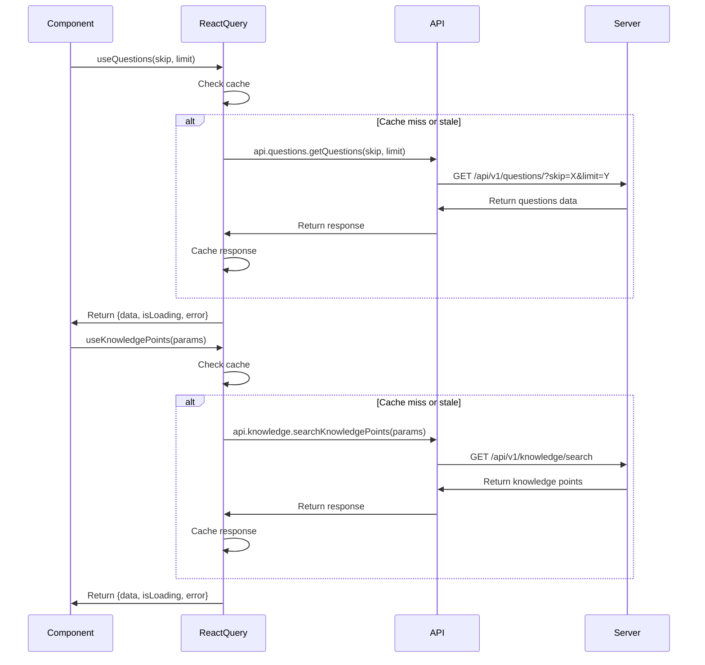
```mermaid
sequenceDiagram
    participant Component
    participant ReactQuery
    participant API
    participant Server
    
    Component->>ReactQuery: useQuestions(skip, limit)
    ReactQuery->>ReactQuery: Check cache
    
    alt Cache miss or stale
        ReactQuery->>API: api.questions.getQuestions(skip, limit)
        API->>Server: GET /api/v1/questions/?skip=X&limit=Y
        Server->>API: Return questions data
        API->>ReactQuery: Return response
        ReactQuery->>ReactQuery: Cache response
    end
    
    ReactQuery->>Component: Return {data, isLoading, error}
    
    Component->>ReactQuery: useKnowledgePoints(params)
    ReactQuery->>ReactQuery: Check cache
    
    alt Cache miss or stale
        ReactQuery->>API: api.knowledge.searchKnowledgePoints(params)
        API->>Server: GET /api/v1/knowledge/search
        Server->>API: Return knowledge points
        API->>ReactQuery: Return response
        ReactQuery->>ReactQuery: Cache response
    end
    
    ReactQuery->>Component: Return {data, isLoading, error}
```

## 6. API服务封装

基于后端API文档，设计对应的前端API服务：

### 6.1 认证服务

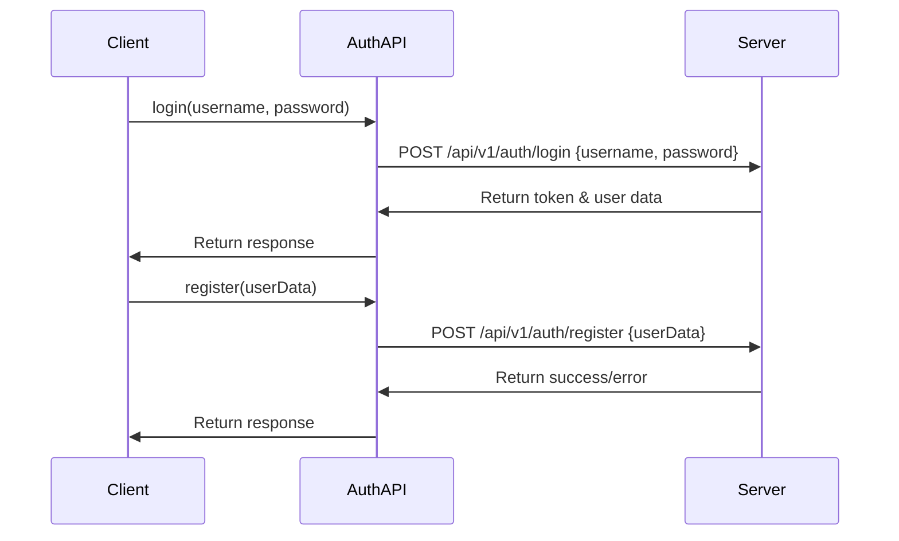
```mermaid
sequenceDiagram
    participant Client
    participant AuthAPI
    participant Server
    
    Client->>AuthAPI: login(username, password)
    AuthAPI->>Server: POST /api/v1/auth/login {username, password}
    Server->>AuthAPI: Return token & user data
    AuthAPI->>Client: Return response
    
    Client->>AuthAPI: register(userData)
    AuthAPI->>Server: POST /api/v1/auth/register {userData}
    Server->>AuthAPI: Return success/error
    AuthAPI->>Client: Return response
```

### 6.2 错题服务

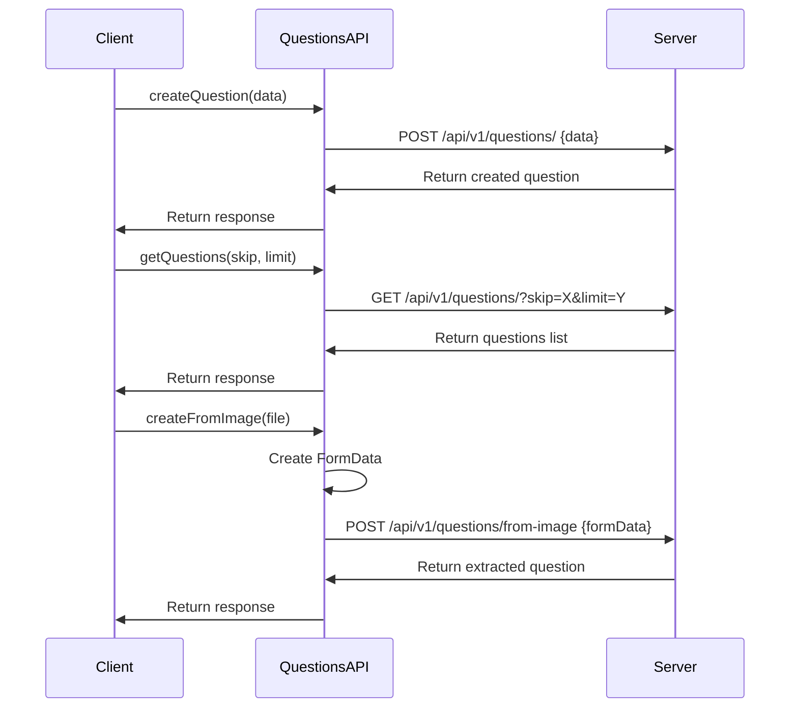
```mermaid
sequenceDiagram
    participant Client
    participant QuestionsAPI
    participant Server
    
    Client->>QuestionsAPI: createQuestion(data)
    QuestionsAPI->>Server: POST /api/v1/questions/ {data}
    Server->>QuestionsAPI: Return created question
    QuestionsAPI->>Client: Return response
    
    Client->>QuestionsAPI: getQuestions(skip, limit)
    QuestionsAPI->>Server: GET /api/v1/questions/?skip=X&limit=Y
    Server->>QuestionsAPI: Return questions list
    QuestionsAPI->>Client: Return response
    
    Client->>QuestionsAPI: createFromImage(file)
    QuestionsAPI->>QuestionsAPI: Create FormData
    QuestionsAPI->>Server: POST /api/v1/questions/from-image {formData}
    Server->>QuestionsAPI: Return extracted question
    QuestionsAPI->>Client: Return response
```

### 6.3 知识点服务

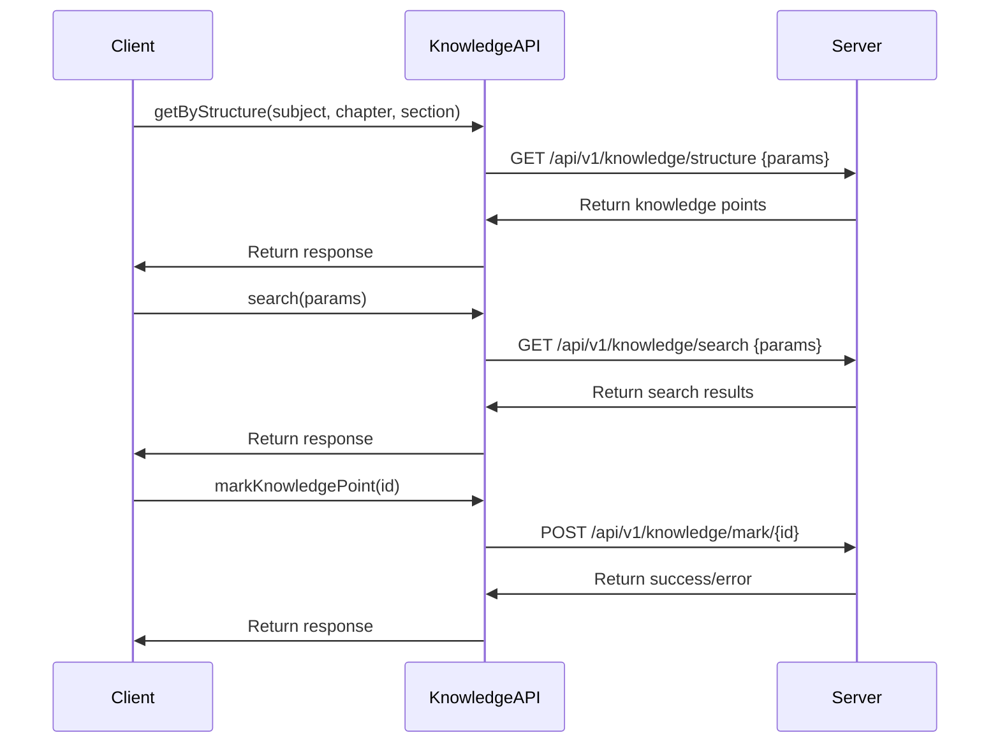
```mermaid
sequenceDiagram
    participant Client
    participant KnowledgeAPI
    participant Server
    
    Client->>KnowledgeAPI: getByStructure(subject, chapter, section)
    KnowledgeAPI->>Server: GET /api/v1/knowledge/structure {params}
    Server->>KnowledgeAPI: Return knowledge points
    KnowledgeAPI->>Client: Return response
    
    Client->>KnowledgeAPI: search(params)
    KnowledgeAPI->>Server: GET /api/v1/knowledge/search {params}
    Server->>KnowledgeAPI: Return search results
    KnowledgeAPI->>Client: Return response
    
    Client->>KnowledgeAPI: markKnowledgePoint(id)
    KnowledgeAPI->>Server: POST /api/v1/knowledge/mark/{id}
    Server->>KnowledgeAPI: Return success/error
    KnowledgeAPI->>Client: Return response
```

### 6.4 解题服务

```typescript
// api/solving.ts
export const solvingAPI = {
  solveQuestion: (questionId: number) => 
    axios.post(`/api/v1/solving/${questionId}`),
  
  extractKnowledgePoints: (questionId: number) => 
    axios.post(`/api/v1/solving/extract/${questionId}`)
}
```

### 6.5 图像处理服务

```typescript
// api/image.ts
export const imageAPI = {
  processImage: (file: File) => {
    const formData = new FormData();
    formData.append('file', file);
    return axios.post('/api/v1/image/process', formData);
  }
}
```

## 7. 路由设计

基于API功能和页面需求，优化路由结构：

```typescript
// router/index.tsx
const routes = [
  {
    path: '/',
    element: <MainLayout />,
    children: [
      { path: '/', element: <Dashboard /> },
      { path: '/login', element: <Login /> },
      { path: '/register', element: <Register /> },
      
      // 错题管理路由
      { path: '/questions', element: <QuestionList /> },
      { path: '/questions/new', element: <QuestionCreate /> },
      { path: '/questions/:id', element: <QuestionDetail /> },
      { path: '/questions/:id/edit', element: <QuestionEdit /> },
      { path: '/questions/image-upload', element: <ImageUploadQuestion /> },
      
      // 知识点管理路由
      { path: '/knowledge', element: <KnowledgeList /> },
      { path: '/knowledge/subjects/:subject', element: <SubjectView /> },
      { path: '/knowledge/search', element: <KnowledgeSearch /> },
      { path: '/knowledge/popular', element: <PopularKnowledge /> },
      { path: '/knowledge/:id', element: <KnowledgeDetail /> },
      { path: '/knowledge/user-marks', element: <UserMarks /> },
      
      // 解题路由
      { path: '/solve/:questionId', element: <SolveQuestion /> },
      { path: '/extract/:questionId', element: <ExtractKnowledge /> },
      
      // 用户设置
      { path: '/settings', element: <UserSettings /> },
    ]
  }
];
```

## 8. 认证与权限控制

### 8.1 JWT认证流程

基于后端Bearer Token认证机制：

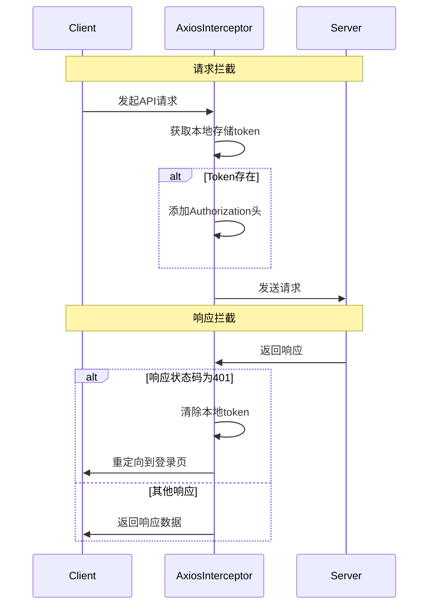
```mermaid
sequenceDiagram
    participant Client
    participant AxiosInterceptor
    participant Server
    
    Note over Client,Server: 请求拦截
    Client->>AxiosInterceptor: 发起API请求
    AxiosInterceptor->>AxiosInterceptor: 获取本地存储token
    
    alt Token存在
        AxiosInterceptor->>AxiosInterceptor: 添加Authorization头
    end
    
    AxiosInterceptor->>Server: 发送请求
    
    Note over Client,Server: 响应拦截
    Server->>AxiosInterceptor: 返回响应
    
    alt 响应状态码为401
        AxiosInterceptor->>AxiosInterceptor: 清除本地token
        AxiosInterceptor->>Client: 重定向到登录页
    else 其他响应
        AxiosInterceptor->>Client: 返回响应数据
    end
```

### 8.2 权限控制组件

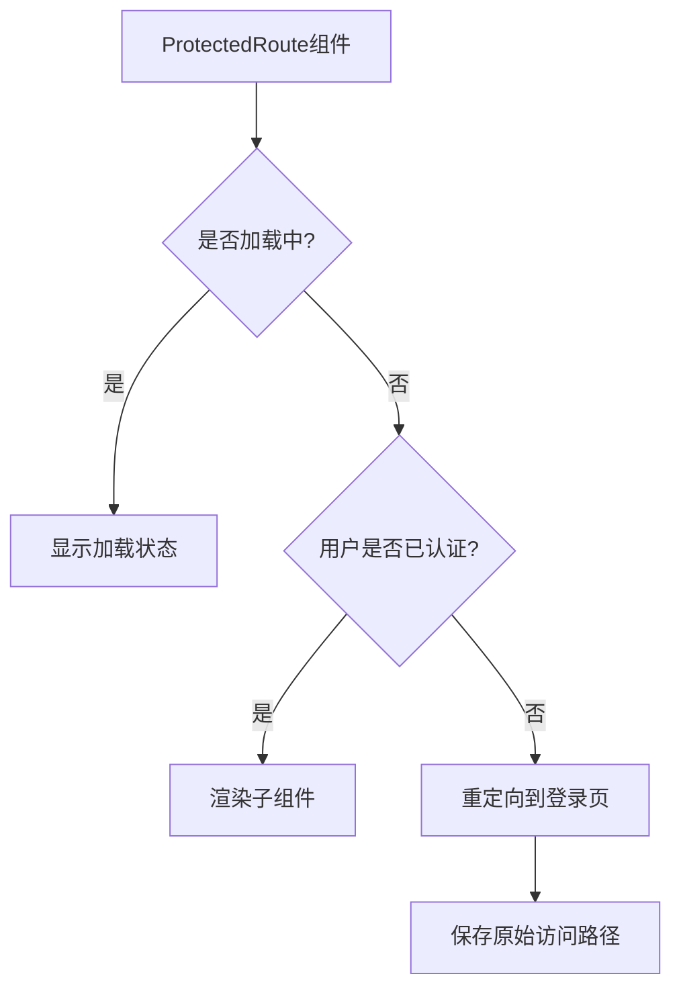
```mermaid
flowchart TD
    A[ProtectedRoute组件] --> B{是否加载中?}
    B -- 是 --> C[显示加载状态]
    B -- 否 --> D{用户是否已认证?}
    D -- 是 --> E[渲染子组件]
    D -- 否 --> F[重定向到登录页]
    F --> G[保存原始访问路径]
```

## 9. 核心功能实现

### 9.1 错题图片上传与OCR

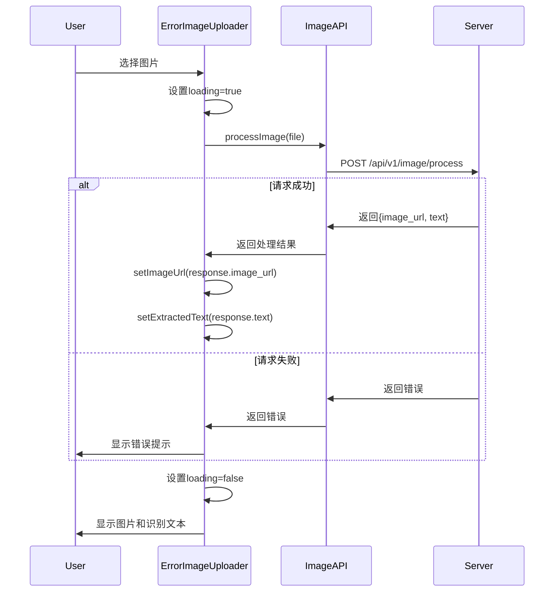
```mermaid
sequenceDiagram
    participant User
    participant ErrorImageUploader
    participant ImageAPI
    participant Server
    
    User->>ErrorImageUploader: 选择图片
    ErrorImageUploader->>ErrorImageUploader: 设置loading=true
    ErrorImageUploader->>ImageAPI: processImage(file)
    ImageAPI->>Server: POST /api/v1/image/process
    
    alt 请求成功
        Server->>ImageAPI: 返回{image_url, text}
        ImageAPI->>ErrorImageUploader: 返回处理结果
        ErrorImageUploader->>ErrorImageUploader: setImageUrl(response.image_url)
        ErrorImageUploader->>ErrorImageUploader: setExtractedText(response.text)
    else 请求失败
        Server->>ImageAPI: 返回错误
        ImageAPI->>ErrorImageUploader: 返回错误
        ErrorImageUploader->>User: 显示错误提示
    end
    
    ErrorImageUploader->>ErrorImageUploader: 设置loading=false
    ErrorImageUploader->>User: 显示图片和识别文本
```

### 9.2 知识点结构化展示

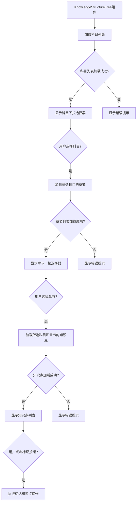
```mermaid
flowchart TD
    A[KnowledgeStructureTree组件] --> B[加载科目列表]
    B --> C{科目列表加载成功?}
    C -- 是 --> D[显示科目下拉选择器]
    C -- 否 --> E[显示错误提示]
    
    D --> F{用户选择科目?}
    F -- 是 --> G[加载所选科目的章节]
    G --> H{章节列表加载成功?}
    H -- 是 --> I[显示章节下拉选择器]
    H -- 否 --> J[显示错误提示]
    
    I --> K{用户选择章节?}
    K -- 是 --> L[加载所选科目和章节的知识点]
    L --> M{知识点加载成功?}
    M -- 是 --> N[显示知识点列表]
    M -- 否 --> O[显示错误提示]
    
    N --> P{用户点击标记按钮?}
    P -- 是 --> Q[执行标记知识点操作]
```

### 9.3 知识点提取

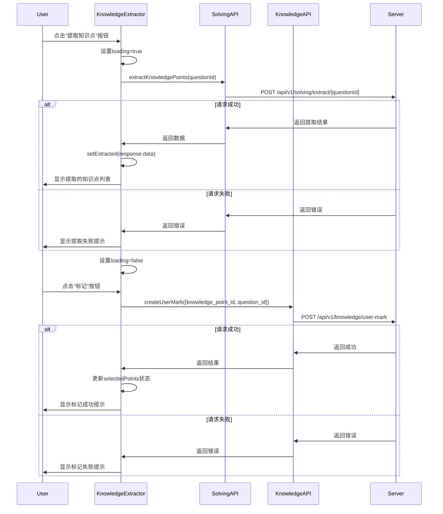
```mermaid
sequenceDiagram
    participant User
    participant KnowledgeExtractor
    participant SolvingAPI
    participant KnowledgeAPI
    participant Server
    
    User->>KnowledgeExtractor: 点击"提取知识点"按钮
    KnowledgeExtractor->>KnowledgeExtractor: 设置loading=true
    KnowledgeExtractor->>SolvingAPI: extractKnowledgePoints(questionId)
    SolvingAPI->>Server: POST /api/v1/solving/extract/{questionId}
    
    alt 请求成功
        Server->>SolvingAPI: 返回提取结果
        SolvingAPI->>KnowledgeExtractor: 返回数据
        KnowledgeExtractor->>KnowledgeExtractor: setExtracted(response.data)
        KnowledgeExtractor->>User: 显示提取的知识点列表
    else 请求失败
        Server->>SolvingAPI: 返回错误
        SolvingAPI->>KnowledgeExtractor: 返回错误
        KnowledgeExtractor->>User: 显示提取失败提示
    end
    
    KnowledgeExtractor->>KnowledgeExtractor: 设置loading=false
    
    User->>KnowledgeExtractor: 点击"标记"按钮
    KnowledgeExtractor->>KnowledgeAPI: createUserMark({knowledge_point_id, question_id})
    KnowledgeAPI->>Server: POST /api/v1/knowledge/user-mark
    
    alt 请求成功
        Server->>KnowledgeAPI: 返回成功
        KnowledgeAPI->>KnowledgeExtractor: 返回结果
        KnowledgeExtractor->>KnowledgeExtractor: 更新selectedPoints状态
        KnowledgeExtractor->>User: 显示标记成功提示
    else 请求失败
        Server->>KnowledgeAPI: 返回错误
        KnowledgeAPI->>KnowledgeExtractor: 返回错误
        KnowledgeExtractor->>User: 显示标记失败提示
    end
```

## 10. 性能优化策略

### 10.1 数据预取与缓存

使用React Query实现数据预取和缓存：

```typescript
// 配置全局缓存策略
const queryClient = new QueryClient({
  defaultOptions: {
    queries: {
      refetchOnWindowFocus: false,
      staleTime: 5 * 60 * 1000, // 5分钟
      cacheTime: 30 * 60 * 1000, // 30分钟
      retry: 1
    }
  }
});
```

### 10.2 按需加载与代码分割

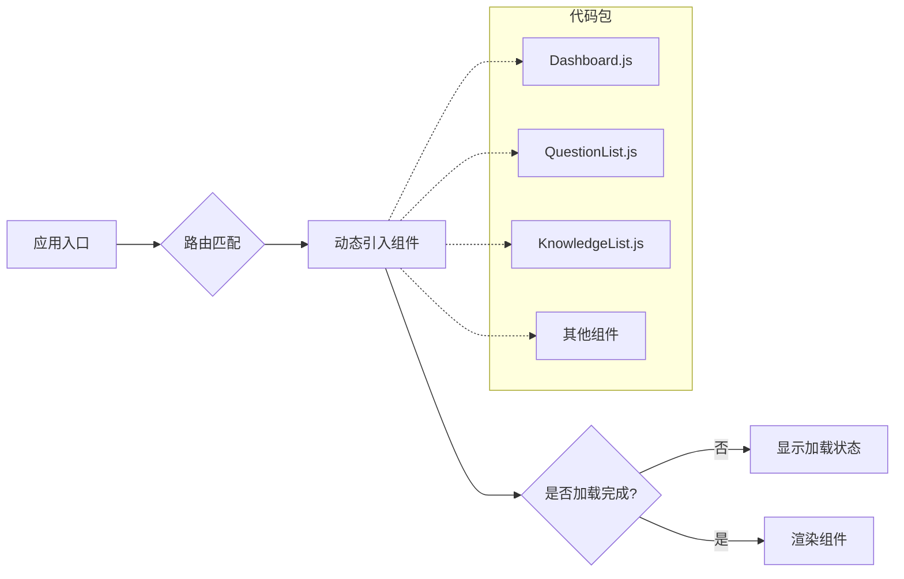
```mermaid
flowchart LR
    A[应用入口] --> B{路由匹配}
    B --> C[动态引入组件]
    C --> D{是否加载完成?}
    D -- 否 --> E[显示加载状态]
    D -- 是 --> F[渲染组件]
    
    subgraph 代码包
    G[Dashboard.js]
    H[QuestionList.js]
    I[KnowledgeList.js]
    J[其他组件]
    end
    
    C -.-> G
    C -.-> H
    C -.-> I
    C -.-> J
```

### 10.3 虚拟列表

对于长列表数据，使用虚拟列表优化性能：

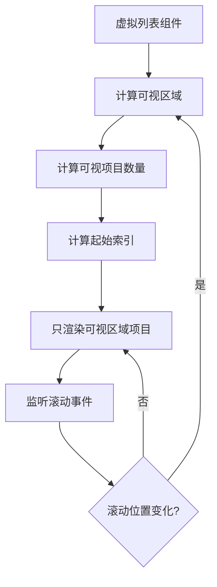
```mermaid
flowchart TD
    A[虚拟列表组件] --> B[计算可视区域]
    B --> C[计算可视项目数量]
    C --> D[计算起始索引]
    D --> E[只渲染可视区域项目]
    E --> F[监听滚动事件]
    F --> G{滚动位置变化?}
    G -- 是 --> B
    G -- 否 --> E
```


## 12. 开发规范与最佳实践

### 12.1 组件开发规范

- 采用函数式组件和React Hooks
- 组件拆分原则：单一职责，可复用性
- 组件命名：PascalCase，描述组件功能
- Props类型使用TypeScript接口定义

### 12.2 状态管理原则

- 本地状态：使用useState/useReducer管理组件内部状态
- 全局状态：使用Redux管理应用级状态
- 服务器状态：使用React Query管理API数据状态

### 12.3 TypeScript类型定义

```typescript
// types/index.ts

// 错题类型
export interface Question {
  id: number;
  user_id: number;
  content: string;
  solution?: string;
  remarks?: string;
  image_url?: string;
  created_at: string;
}

// 知识点类型
export interface KnowledgePoint {
  id: number;
  subject: string;
  chapter: string;
  section: string;
  item: string;
  details: string;
  mark_count: number;
  created_at: string;
}

// 用户标记类型
export interface UserMark {
  id: number;
  user_id: number;
  knowledge_point_id: number;
  question_id: number;
  marked_at: string;
}
```

## 13. 测试与质量保障

### 13.1 单元测试示例

```typescript
// __tests__/components/ErrorSubmitForm.test.tsx
import { render, screen, fireEvent } from '@testing-library/react';
import ErrorSubmitForm from '../../components/business/ErrorSubmitForm';

test('renders error submit form', () => {
  render(<ErrorSubmitForm />);
  expect(screen.getByText('提交错题')).toBeInTheDocument();
});

test('shows validation error for empty content', async () => {
  render(<ErrorSubmitForm />);
  fireEvent.click(screen.getByText('提交'));
  
  expect(await screen.findByText('请输入错题内容')).toBeInTheDocument();
});
```

### 13.2 端到端测试示例

```typescript
// cypress/integration/error-submit.spec.js
describe('错题提交流程', () => {
  beforeEach(() => {
    cy.login(); // 自定义命令：登录
    cy.visit('/questions/new');
  });
  
  it('可以成功提交错题', () => {
    cy.get('textarea[name="content"]').type('这是一道测试错题');
    cy.get('textarea[name="remarks"]').type('测试备注');
    cy.get('button[type="submit"]').click();
    
    cy.url().should('include', '/questions/');
    cy.contains('错题提交成功');
  });
});
```

## 14. 错误处理机制

为保证系统稳定性和用户体验，GradNote前端应实现全面的错误处理策略，涵盖各类可能出现的错误情况。

### 14.1 错误处理层次架构

前端错误处理应采用分层设计，确保错误被及时捕获并得到合理处理。

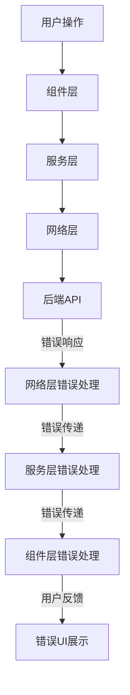
```mermaid
graph TD
    A[用户操作] --> B[组件层]
    B --> C[服务层]
    C --> D[网络层]
    D --> E[后端API]
    
    E -- 错误响应 --> F[网络层错误处理]
    F -- 错误传递 --> G[服务层错误处理]
    G -- 错误传递 --> H[组件层错误处理]
    H -- 用户反馈 --> I[错误UI展示]
```

### 14.2 网络请求错误处理

针对API请求过程中可能出现的各类网络错误，设计系统性处理方案。

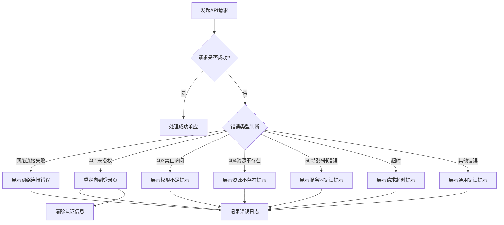
```mermaid
flowchart TD
    A[发起API请求] --> B{请求是否成功?}
    B -- 是 --> C[处理成功响应]
    B -- 否 --> D{错误类型判断}
    
    D -- 网络连接失败 --> E[展示网络连接错误]
    D -- 401未授权 --> F[重定向到登录页]
    D -- 403禁止访问 --> G[展示权限不足提示]
    D -- 404资源不存在 --> H[展示资源不存在提示]
    D -- 500服务器错误 --> I[展示服务器错误提示]
    D -- 超时 --> J[展示请求超时提示]
    D -- 其他错误 --> K[展示通用错误提示]
    
    E & F & G & H & I & J & K --> L[记录错误日志]
    F --> M[清除认证信息]
```

### 14.3 业务错误处理策略

业务错误是指请求成功但返回业务操作失败的情况，需要针对不同业务场景设计特定处理方案。

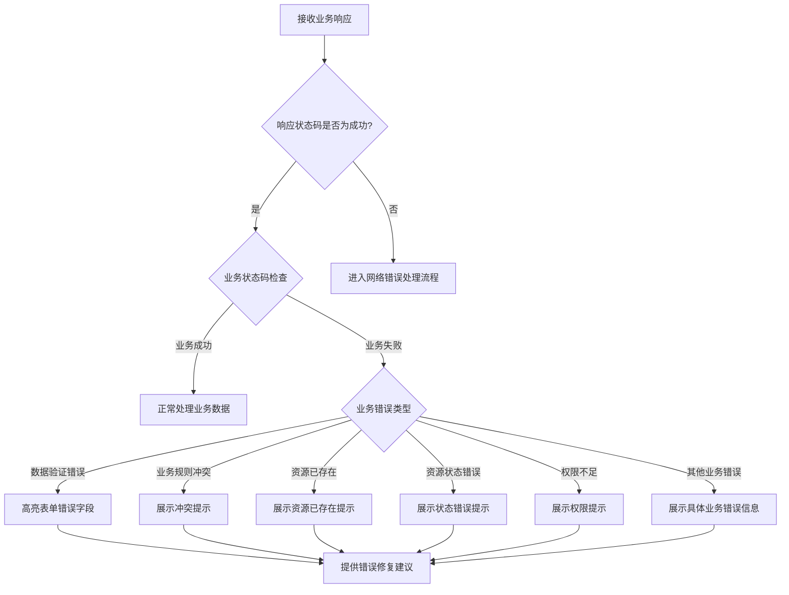
```mermaid
flowchart TD
    A[接收业务响应] --> B{响应状态码是否为成功?}
    B -- 是 --> C{业务状态码检查}
    B -- 否 --> D[进入网络错误处理流程]
    
    C -- 业务成功 --> E[正常处理业务数据]
    C -- 业务失败 --> F{业务错误类型}
    
    F -- 数据验证错误 --> G[高亮表单错误字段]
    F -- 业务规则冲突 --> H[展示冲突提示]
    F -- 资源已存在 --> I[展示资源已存在提示]
    F -- 资源状态错误 --> J[展示状态错误提示]
    F -- 权限不足 --> K[展示权限提示]
    F -- 其他业务错误 --> L[展示具体业务错误信息]
    
    G & H & I & J & K & L --> M[提供错误修复建议]
```

### 14.4 异常边界与组件错误处理

为防止组件渲染错误导致整个应用崩溃，实现React错误边界机制。

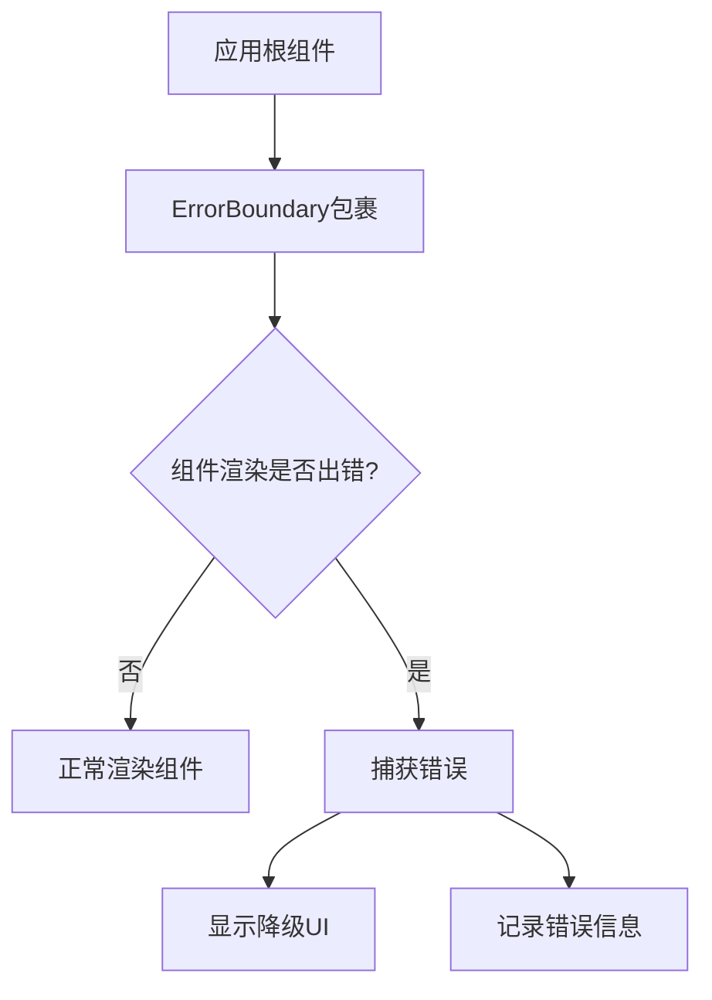
```mermaid
graph TD
    A[应用根组件] --> B[ErrorBoundary包裹]
    B --> C{组件渲染是否出错?}
    C -- 否 --> D[正常渲染组件]
    C -- 是 --> E[捕获错误]
    E --> F[显示降级UI]
    E --> G[记录错误信息]
```

### 14.5 错误反馈与用户体验

设计友好的错误反馈机制，提升用户体验。

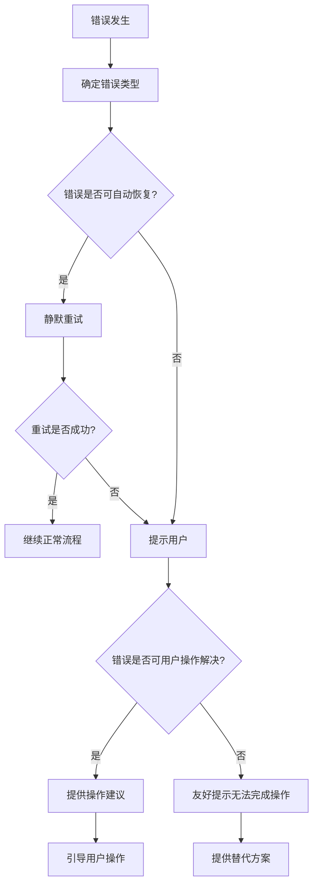
```mermaid
flowchart TD
    A[错误发生] --> B[确定错误类型]
    B --> C{错误是否可自动恢复?}
    
    C -- 是 --> D[静默重试]
    D --> E{重试是否成功?}
    E -- 是 --> F[继续正常流程]
    E -- 否 --> G[提示用户]
    
    C -- 否 --> G
    G --> H{错误是否可用户操作解决?}
    
    H -- 是 --> I[提供操作建议]
    I --> J[引导用户操作]
    
    H -- 否 --> K[友好提示无法完成操作]
    K --> L[提供替代方案]
```

### 14.6 全局错误处理配置

在应用级别实现统一的错误处理配置，确保一致性和可维护性。

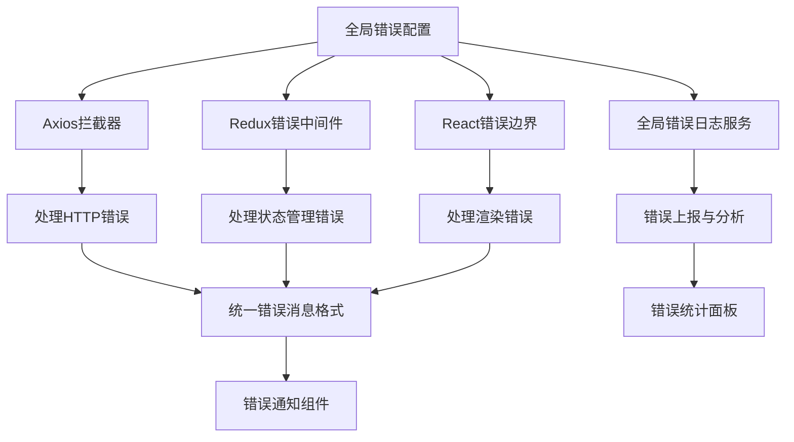
```mermaid
graph TD
    A[全局错误配置] --> B[Axios拦截器]
    A --> C[Redux错误中间件]
    A --> D[React错误边界]
    A --> E[全局错误日志服务]
    
    B --> F[处理HTTP错误]
    C --> G[处理状态管理错误]
    D --> H[处理渲染错误]
    E --> I[错误上报与分析]
    
    F & G & H --> J[统一错误消息格式]
    J --> K[错误通知组件]
    I --> L[错误统计面板]
```

### 14.7 错误日志与监控

建立完善的错误日志收集和监控系统，及时发现并解决问题。

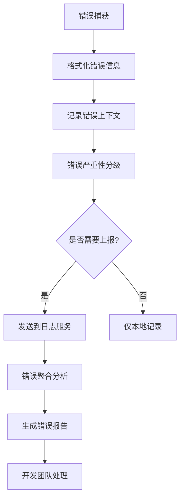
```mermaid
flowchart TD
    A[错误捕获] --> B[格式化错误信息]
    B --> C[记录错误上下文]
    C --> D[错误严重性分级]
    D --> E{是否需要上报?}
    
    E -- 是 --> F[发送到日志服务]
    F --> G[错误聚合分析]
    G --> H[生成错误报告]
    H --> I[开发团队处理]
    
    E -- 否 --> J[仅本地记录]
```

### 14.8 错误处理最佳实践

1. **错误预防**：
   - 实施严格的输入验证
   - 使用TypeScript类型检查
   - 编写防御性代码
   - 添加单元测试覆盖边缘情况

2. **优雅降级**：
   - 设计关键功能的降级方案
   - 实现部分加载机制
   - 提供离线功能支持

3. **用户体验优化**：
   - 避免技术术语错误
   - 提供清晰的解决步骤
   - 设计一致的错误UI样式

4. **错误恢复机制**：
   - 实现自动重试机制
   - 提供手动重试选项
   - 保存用户输入数据防止丢失

5. **错误追踪**：
   - 为每个错误生成唯一ID
   - 记录错误环境信息
   - 实现用户反馈渠道
