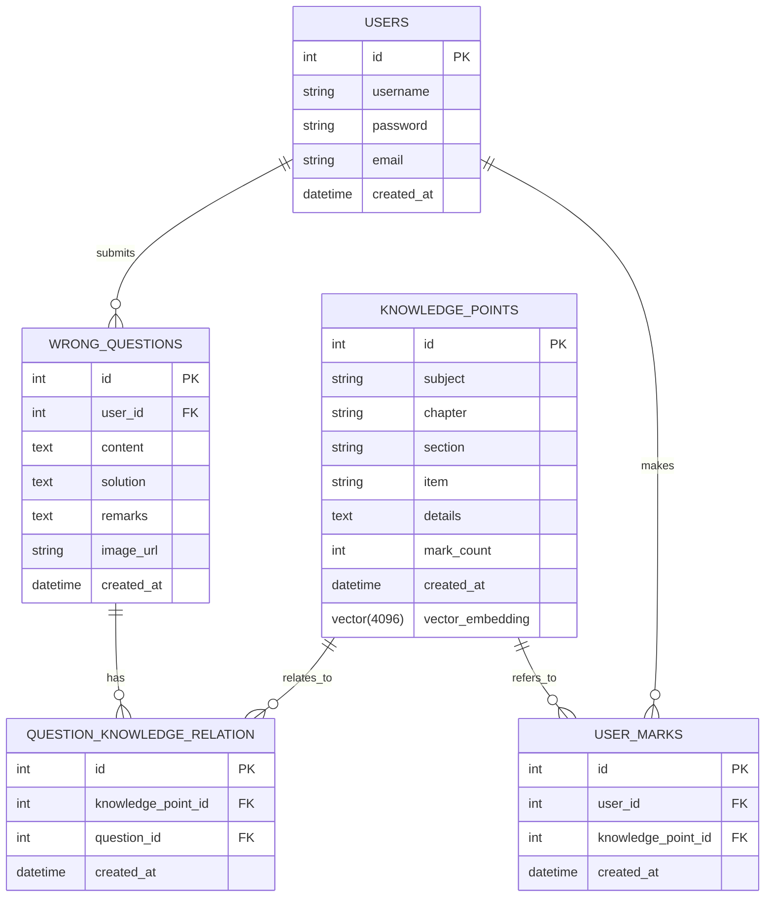

# GradNote 后端项目文档规范与结构

## 1. 文档编写规范

### 1.1. 基本原则

- **实用性优先**：文档应当以解决实际问题为导向，避免过度理论化
- **保持更新**：代码变更时同步更新相关文档
- **一致性**：遵循统一的格式、术语和结构
- **完整性**：确保覆盖所有关键功能和模块
- **简洁明了**：使用清晰、简洁的语言，避免冗余
- **面向受众**：根据不同读者（开发者、管理员、新成员）调整内容深度

### 1.2. 语言与格式

- **语言**：使用简体中文作为主要语言，技术术语可保留英文原文
- **Markdown格式**：所有文档使用Markdown格式编写，便于版本控制和在线阅读
- **代码示例**：使用代码块（```）包裹代码，并标注语言类型
- **标题层级**：最多使用四级标题，保持层级清晰
- **图表**：复杂概念使用图表说明，支持Mermaid语法
- **链接**：使用相对路径链接到其他文档或代码文件
- **术语一致**：项目特定术语在文档中保持一致
- **代码内文档**：函数和类的文档字符串，遵循Python docstring规范

### 1.4. 文档审核与维护

- 重要文档变更需经过审核
- 定期检查文档的准确性和时效性
- 鼓励所有团队成员参与文档维护
- 使用TODO标记需要补充的内容

## 2. 项目文档大纲

### I. 项目概述

#### 1.1. 项目简介

GradNote是一个错题知识点管理系统，旨在帮助学生高效管理和学习错题。系统通过AI技术分析错题，提取知识点，并提供智能解题功能，帮助学生理解和掌握相关知识点。

#### 1.2. 系统功能

- 错题管理：添加、编辑、删除、查询错题
- 知识点提取：自动从错题中提取关键知识点
- 智能解题：基于知识点提供解题思路和步骤
- 图像处理：支持从图片中提取题目文本
- 用户管理：用户注册、登录、权限控制

#### 1.3. 技术架构

- **后端框架**：FastAPI
- **数据库**：PostgreSQL + pgvector
- **AI模型集成**：LangChain + LangGraph
- **认证**：JWT
- **监控**：Langfuse

### II. 快速开始

#### 2.1. 环境要求

- Python 3.13+
- PostgreSQL 17+（需启用pgvector扩展）
- Redis（可选，用于缓存）
- 兼容OpenAI API的LLM服务

#### 2.2. 安装与配置

1. **克隆仓库**

```bash
git clone https://github.com/black-zero358/GradNote.git
cd GradNote
```

2. **安装依赖**

```bash
pip install -r backend/requirements.txt
```

3. **环境变量配置**

复制`.env.example`文件为`.env`并配置以下必要参数：

```
# 数据库配置
POSTGRES_SERVER=localhost
POSTGRES_USER=postgres
POSTGRES_PASSWORD=your_password
POSTGRES_DB=GradNote
POSTGRES_PORT=5432

# 安全配置
SECRET_KEY=your_generated_secret_key_here

# LLM设置
OPENAI_API_KEY=your_api_key
OPENAI_API_BASE=your_api_base_url
```

4. **初始化数据库**

```bash
cd backend
python -m app.db.create_tables
```

5. **启动服务**

```bash
uvicorn app.main:app --reload
```

#### 2.3. 验证安装

访问 http://localhost:8000/docs 查看API文档界面，确认服务正常运行。

### III. 项目结构

#### 3.1. 目录结构

```
backend/
├── app/                    # 应用主目录
│   ├── api/                # API路由模块
│   │   ├── deps.py         # API依赖项
│   │   ├── routes/         # 路由定义
│   │   └── schemas/        # Pydantic模型
│   │
│   ├── core/               # 核心配置
│   │   ├── config.py       # 配置管理
│   │   └── security.py     # 安全配置
│   │
│   ├── db/                 # 数据库模块
│   │   ├── create_tables.py # 创建表
│   │   ├── init_db.py      # 初始化数据
│   │   ├── create_index.py # 创建索引
│   │   ├── reset_sequence.py # 重置序列
│   │   └── session.py      # 会话管理
│   │
│   ├── llm_services/       # LLM服务
│   │   ├── image_processing/ # 图像处理
│   │   ├── knowledge_mark/ # 知识点标记
│   │   ├── knowledge_retriever/ # 知识点检索
│   │   └── solving/        # 解题服务
│   │
│   ├── models/             # 数据模型
│   │   ├── user.py         # 用户模型
│   │   ├── question.py     # 错题模型
│   │   └── knowledge.py    # 知识点模型
│   │
│   ├── services/           # 业务服务
│   │   ├── user.py         # 用户服务
│   │   ├── question.py     # 错题服务
│   │   ├── knowledge.py    # 知识点服务
│   │   ├── solving.py      # 解题服务
│   │   └── image.py        # 图像服务
│   │
│   └── main.py             # 应用入口
│
├── requirements.txt        # 依赖
├── .env.example            # 环境变量示例
└── uploads/                # 上传文件目录
```

#### 3.2. 核心模块说明

- **api**：定义所有HTTP接口，包括路由、请求/响应模型
- **core**：核心配置和安全相关功能
- **db**：数据库连接和初始化
- **llm_services**：AI模型集成，包括图像处理、知识点提取、解题等
- **models**：SQLAlchemy数据库模型
- **services**：业务逻辑层，连接API和数据库

### IV. API文档

#### 4.1. API设计原则

- **RESTful设计**：遵循REST架构风格
- **版本控制**：API路径包含版本号（/api/v1/）
- **一致性**：保持请求/响应格式一致
- **状态码**：正确使用HTTP状态码
- **错误处理**：统一的错误响应格式
- **文档化**：所有API都有详细文档
- **异步处理**：所有API路由使用异步函数，防止阻塞

#### 4.2. 认证API

| 端点 | 方法 | 描述 | 认证要求 |
|------|------|------|----------|
| `/api/v1/auth/login` | POST | 用户登录 | 无 |
| `/api/v1/auth/register` | POST | 用户注册 | 无 |

#### 4.3. 错题API

| 端点 | 方法 | 描述 | 认证要求 |
|------|------|------|----------|
| `/api/v1/questions` | GET | 获取错题列表 | JWT |
| `/api/v1/questions` | POST | 创建新错题 | JWT |
| `/api/v1/questions/{question_id}` | GET | 获取错题详情 | JWT |
| `/api/v1/questions/{question_id}` | PUT | 更新错题 | JWT |
| `/api/v1/questions/{question_id}` | DELETE | 删除错题 | JWT |
| `/api/v1/questions/from-image` | POST | 从图片创建错题 | JWT |

#### 4.4. 知识点API

| 端点 | 方法 | 描述 | 认证要求 |
|------|------|------|----------|
| `/api/v1/knowledge/structure` | GET | 按结构查询知识点 | JWT |
| `/api/v1/knowledge/search` | GET | 搜索知识点 | JWT |
| `/api/v1/knowledge/popular` | GET | 获取热门知识点 | JWT |
| `/api/v1/knowledge/subjects` | GET | 获取科目列表 | JWT |
| `/api/v1/knowledge/chapters` | GET | 获取章节列表 | JWT |
| `/api/v1/knowledge/sections` | GET | 获取小节列表 | JWT |
| `/api/v1/knowledge/{knowledge_point_id}` | GET | 获取知识点详情 | JWT |
| `/api/v1/knowledge` | POST | 创建知识点 | JWT |
| `/api/v1/knowledge/mark/{knowledge_point_id}` | POST | 标记知识点 | JWT |
| `/api/v1/knowledge/user-mark` | POST | 创建用户标记 | JWT |
| `/api/v1/knowledge/user-marks` | GET | 获取用户标记 | JWT |
| `/api/v1/knowledge/analyze-from-question` | POST | 分析题目提取知识点 | JWT |
| `/api/v1/knowledge/extract-from-solution` | POST | 从解题过程提取知识点 | JWT |

#### 4.5. 解题API

| 端点 | 方法 | 描述 | 认证要求 |
|------|------|------|----------|
| `/api/v1/solving/{question_id}` | POST | 解答错题 | JWT |

#### 4.6. 图像处理API

| 端点 | 方法 | 描述 | 认证要求 |
|------|------|------|----------|
| `/api/v1/image/process` | POST | 处理错题图像 | JWT |
| `/api/v1/image/extract-answer` | POST | 从图片提取答案 | JWT |

#### 4.7. API响应格式

**成功响应**：
```json
{
  "data": {...},  // 响应数据
  "message": "操作成功"  // 可选
}
```

**错误响应**：
```json
{
  "detail": "错误信息",
  "error_code": "ERROR_CODE"  // 可选
}
```

### V. 数据库设计

#### 5.1. 实体关系图



#### 5.2. 表结构说明

**users表**：存储用户信息
- id：主键
- username：用户名
- password：密码（哈希存储）
- email：邮箱
- created_at：创建时间

**wrong_questions表**：存储错题信息
- id：主键
- user_id：用户ID（外键）
- content：题目内容
- solution：解题过程
- remarks：备注
- image_url：图片URL
- created_at：创建时间

**knowledge_points表**：存储知识点信息
- id：主键
- subject：科目
- chapter：章节
- section：小节
- item：具体知识点
- details：详细说明
- mark_count：标记次数
- created_at：创建时间
- vector_embedding：向量嵌入（用于相似搜索）

**question_knowledge_relation表**：错题与知识点的关联
- id：主键
- knowledge_point_id：知识点ID（外键）
- question_id：错题ID（外键）
- created_at：创建时间

**user_marks表**：用户对知识点的标记
- id：主键
- user_id：用户ID（外键）
- knowledge_point_id：知识点ID（外键）
- created_at：创建时间

### VI. LLM服务集成

#### 6.1. 架构设计

GradNote使用LangChain和LangGraph框架集成大型语言模型，实现以下功能：

- 图像处理：从错题图片中提取文本
- 知识点提取：分析错题内容，提取相关知识点
- 智能解题：基于知识点生成解题步骤
- 知识点标记：从解题过程中提取使用的知识点

#### 6.2. 模型配置

系统支持任何兼容OpenAI API的模型服务，默认配置：

- **LLM模型**：deepseek-v3-250324（用于文本处理）
- **VLM模型**：doubao-1-5-vision-pro-32k-250115（用于图像处理）
- **Embedding模型**：doubao-embedding-large-text-240915（用于向量嵌入）

#### 6.3. 工作流程

**图像处理流程**：
1. 接收用户上传的错题图片
2. 验证图片格式和大小
3. 调用VLM模型提取图片中的文本
4. 返回提取结果

**解题流程**：
1. 接收错题ID和相关知识点
2. 获取错题内容和知识点详情
3. 构建LangGraph工作流
4. 使用LLM生成解题步骤
5. 审查解题结果
6. 如果审查不通过，重试解题
7. 返回最终解题结果

#### 6.4. 监控与可观察性

使用Langfuse进行LLM调用的监控和分析：

- 跟踪每次LLM调用
- 记录提示词和响应
- 分析性能和成本
- 监控错误率

### VII. 安全与认证

#### 7.1. 认证机制

系统使用JWT（JSON Web Token）进行用户认证：

- 用户登录后获取访问令牌
- 令牌包含用户ID和过期时间
- 默认令牌有效期为24小时
- 所有受保护的API需要在请求头中包含有效令牌

#### 7.2. 密码安全

- 使用bcrypt算法哈希存储密码
- 不在任何地方存储明文密码
- 密码验证通过哈希比对完成

#### 7.3. API安全

- 使用HTTPS加密传输（生产环境）
- 实施CORS策略限制跨域请求
- 所有用户输入经过验证和清理
- 使用参数化查询防止SQL注入

#### 7.4. 数据安全

- 敏感配置通过环境变量管理
- API密钥和密码不硬编码在代码中
- 定期备份数据库
- 实施最小权限原则

### VIII. 部署指南

#### 8.1. 开发环境

```bash
# 启动开发服务器
uvicorn app.main:app --reload --host 0.0.0.0 --port 8000
```

#### 8.2. 生产环境

**使用Docker部署**：

```bash
# 构建Docker镜像
docker build -t gradnote-backend .

# 运行容器
docker run -d -p 8000:8000 \
  --env-file .env \
  --name gradnote-backend \
  gradnote-backend
```

**使用Docker Compose**：

```yaml
version: '3'
services:
  backend:
    build: ./backend
    ports:
      - "8000:8000"
    env_file:
      - .env
    depends_on:
      - db
    volumes:
      - ./uploads:/app/uploads

  db:
    image: postgres:17
    environment:
      - POSTGRES_USER=${POSTGRES_USER}
      - POSTGRES_PASSWORD=${POSTGRES_PASSWORD}
      - POSTGRES_DB=${POSTGRES_DB}
    volumes:
      - postgres_data:/var/lib/postgresql/data

volumes:
  postgres_data:
```

#### 8.3. 环境变量配置

生产环境需要配置以下环境变量：

```
# 数据库配置
POSTGRES_SERVER=db
POSTGRES_USER=postgres
POSTGRES_PASSWORD=secure_password
POSTGRES_DB=GradNote
POSTGRES_PORT=5432

# 安全配置
SECRET_KEY=complex_random_string
ACCESS_TOKEN_EXPIRE_MINUTES=1440  # 24小时

# CORS配置
BACKEND_CORS_ORIGINS=["https://yourdomain.com"]

# LLM配置
OPENAI_API_KEY=your_api_key
OPENAI_API_BASE=your_api_base
OPENAI_LLM_MODEL=your_model
OPENAI_VLM_MODEL=your_vision_model
OPENAI_EMBEDDING_MODEL=your_embedding_model

# 服务配置
DEBUG=false
WORKERS=4
API_PORT=8000
API_HOST=0.0.0.0
UPLOAD_DIR=uploads
```

### IX. 开发指南

#### 9.1. 代码风格

- 遵循PEP 8规范
- 使用类型注解
- 函数和类添加文档字符串
- 变量和函数使用小写下划线命名法
- 类使用驼峰命名法

#### 9.2. API开发流程

1. 在`app/api/schemas`中定义请求和响应模型
2. 在`app/services`中实现业务逻辑
3. 在`app/api/routes`中定义API路由
4. 更新`app/api/routes/api.py`注册新路由
5. 编写测试用例
6. 更新API文档

#### 9.3. 数据库操作

使用SQLAlchemy ORM进行数据库操作：

```python
# 创建
db_item = Model(attr1=value1, attr2=value2)
db.add(db_item)
db.commit()
db.refresh(db_item)

# 查询
items = db.query(Model).filter(Model.attr == value).all()

# 更新
db_item = db.query(Model).filter(Model.id == item_id).first()
db_item.attr = new_value
db.commit()

# 删除
db_item = db.query(Model).filter(Model.id == item_id).first()
db.delete(db_item)
db.commit()
```

#### 9.4. 异常处理

使用FastAPI的HTTPException处理API错误：

```python
from fastapi import HTTPException, status

if not item:
    raise HTTPException(
        status_code=status.HTTP_404_NOT_FOUND,
        detail="Item not found"
    )
```

#### 9.5. 测试指南

使用pytest进行单元测试和集成测试：

```bash
# 运行所有测试
pytest

# 运行特定测试文件
pytest tests/test_api.py

# 运行特定测试函数
pytest tests/test_api.py::test_create_user
```

### X. 故障排除

#### 10.1. 常见问题

**问题**：数据库连接失败
**解决方案**：
- 检查数据库服务是否运行
- 验证数据库连接参数
- 确认网络连接

**问题**：LLM API调用失败
**解决方案**：
- 检查API密钥是否正确
- 验证API基础URL
- 检查网络连接
- 查看API服务提供商状态

**问题**：图像处理失败
**解决方案**：
- 检查图像格式是否支持
- 验证图像大小是否超过限制
- 确认VLM模型配置正确

#### 10.2. 日志查看

系统使用Python标准日志模块记录日志：

```bash
# 查看应用日志
tail -f app.log

# 在Docker环境中查看日志
docker logs gradnote-backend
```

#### 10.3. 性能优化

- 使用Redis缓存频繁访问的数据
- 优化数据库查询
- 使用异步处理长时间运行的任务
- 监控LLM调用性能

### XI. 贡献指南

#### 11.1. 开发流程

1. Fork仓库
2. 创建功能分支
3. 提交更改
4. 创建Pull Request

#### 11.2. 提交规范

使用约定式提交格式：

```
<类型>(<范围>): <描述>

[可选的正文]

[可选的脚注]
```

类型包括：
- feat: 新功能
- fix: 修复bug
- docs: 文档更新
- style: 代码风格更改
- refactor: 代码重构
- perf: 性能优化
- test: 测试相关
- chore: 构建过程或辅助工具变动

#### 11.3. 代码审查

- 所有代码变更需要通过代码审查
- 确保代码符合项目风格
- 验证功能正常工作
- 检查测试覆盖率

### XII. 附录

#### 12.1. 术语表

- **LLM**：大型语言模型
- **VLM**：视觉语言模型
- **JWT**：JSON Web Token
- **ORM**：对象关系映射
- **API**：应用程序接口
- **FastAPI**：Python Web框架
- **SQLAlchemy**：Python SQL工具包和ORM
- **Pydantic**：数据验证和设置管理库
- **LangChain**：LLM应用开发框架
- **LangGraph**：基于LangChain的工作流框架
- **Langfuse**：LLM监控和可观察性平台

#### 12.2. 参考资料

- [FastAPI官方文档](https://fastapi.tiangolo.com/)
- [SQLAlchemy文档](https://docs.sqlalchemy.org/)
- [LangChain文档](https://python.langchain.com/docs/)
- [LangGraph文档](https://langchain-ai.github.io/langgraph/)
- [Langfuse文档](https://langfuse.com/docs)
- [PostgreSQL文档](https://www.postgresql.org/docs/)
- [pgvector文档](https://github.com/pgvector/pgvector)