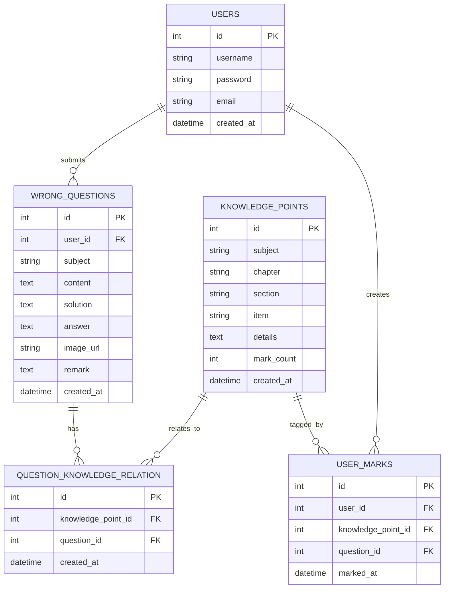

# GradNote 数据库设计文档

## 1. 数据库概述

GradNote 系统使用 PostgreSQL 关系型数据库来存储和管理错题、知识点以及用户数据。数据库设计遵循标准化原则，确保数据的一致性和完整性，同时支持高效的知识点检索和错题管理功能。

## 2. 实体关系模型

系统的数据库结构由以下几个主要实体组成：用户(Users)、错题(Wrong_Questions)、知识点(Knowledge_Points)，以及它们之间的关联关系。

### 2.1 实体关系图



## 3. 表结构设计

### 3.1 用户表 (users)

存储系统用户的基本信息。

| 字段名 | 数据类型 | 说明 | 约束 |
|--------|----------|------|------|
| id | INTEGER | 用户ID | 主键，自增 |
| username | VARCHAR(50) | 用户名 | 非空 |
| password | VARCHAR(100) | 密码哈希值 | 非空 |
| email | VARCHAR(100) | 电子邮箱 | 唯一 |
| created_at | TIMESTAMP | 创建时间 | 默认当前时间 |

### 3.2 错题表 (wrong_questions)

存储用户提交的错题信息。

| 字段名 | 数据类型 | 说明 | 约束 |
|--------|----------|------|------|
| id | INTEGER | 错题ID | 主键，自增 |
| user_id | INTEGER | 用户ID | 外键，关联users表 |
| subject | VARCHAR(50) | 学科分类 | 可空 |
| content | TEXT | 题目内容 | 非空 |
| solution | TEXT | 解题过程 | 可空 |
| answer | TEXT | 正确答案 | 可空 |
| image_url | VARCHAR(255) | 题目图片URL | 可空 |
| remark | TEXT | 备注 | 可空 |
| created_at | TIMESTAMP | 创建时间 | 默认当前时间 |

### 3.3 知识点表 (knowledge_points)

存储系统中的知识点分类与详情。

| 字段名 | 数据类型 | 说明 | 约束 |
|--------|----------|------|------|
| id | INTEGER | 知识点ID | 主键，自增 |
| subject | VARCHAR(50) | 学科 | 非空 |
| chapter | VARCHAR(100) | 章节 | 非空 |
| section | VARCHAR(100) | 小节 | 非空 |
| item | VARCHAR(100) | 知识点名称 | 非空 |
| details | TEXT | 知识点详细说明 | 可空 |
| mark_count | INTEGER | 标记次数 | 默认0 |
| created_at | TIMESTAMP | 创建时间 | 默认当前时间 |

### 3.4 错题知识点关联表 (question_knowledge_relation)

存储错题和知识点之间的多对多关系。

| 字段名 | 数据类型 | 说明 | 约束 |
|--------|----------|------|------|
| id | INTEGER | 关联ID | 主键，自增 |
| knowledge_point_id | INTEGER | 知识点ID | 外键，关联knowledge_points表 |
| question_id | INTEGER | 错题ID | 外键，关联wrong_questions表 |
| created_at | TIMESTAMP | 创建时间 | 默认当前时间 |

### 3.5 用户标记表 (user_marks)

存储用户对知识点的标记记录。

| 字段名 | 数据类型 | 说明 | 约束 |
|--------|----------|------|------|
| id | INTEGER | 标记ID | 主键，自增 |
| user_id | INTEGER | 用户ID | 外键，关联users表 |
| knowledge_point_id | INTEGER | 知识点ID | 外键，关联knowledge_points表 |
| question_id | INTEGER | 错题ID | 外键，关联wrong_questions表 |
| marked_at | TIMESTAMP | 标记时间 | 默认当前时间 |

## 4. 索引设计

为提高查询效率，系统设计了以下索引：

### 4.1 主键索引

每个表的主键字段自动创建索引。

### 4.2 外键索引

所有外键字段创建索引，提高关联查询性能。

### 4.3 复合索引

```sql
-- 知识点层级复合索引，加速按学科-章节-小节查询
CREATE INDEX idx_knowledge_subject_chapter_section ON knowledge_points(subject, chapter, section);

-- 标记次数索引，提高热门知识点查询性能
CREATE INDEX idx_knowledge_mark_count ON knowledge_points(mark_count DESC);

-- 错题表用户ID索引
CREATE INDEX idx_wrong_questions_user_id ON wrong_questions(user_id);

-- 用户标记记录复合索引
CREATE INDEX idx_user_marks_user_knowledge ON user_marks(user_id, knowledge_point_id);

-- 错题备注全文检索索引
CREATE INDEX idx_wrong_questions_remark ON wrong_questions USING gin(to_tsvector('simple', remark));
```

## 5. 数据库初始化

系统在启动时会自动初始化数据库结构并创建必要的索引：

1. 通过SQLAlchemy ORM创建表结构
2. 创建索引以优化查询性能
3. 初始化基础数据（管理员账户和示例知识点）

## 6. 查询优化建议

1. **使用索引进行查询**：尽量利用已创建的索引字段进行筛选和排序
2. **分页查询**：对于大量数据的查询，使用LIMIT和OFFSET进行分页处理
3. **选择性查询**：只查询需要的字段，避免SELECT *
4. **合理使用JOIN**：需要关联数据时使用适当的JOIN操作，避免多次查询
5. **定期维护**：对于频繁更新的表，定期执行VACUUM和ANALYZE操作
6. **监控性能**：使用EXPLAIN ANALYZE分析慢查询，根据执行计划优化SQL语句

## 7. 扩展设计（未来考虑）

1. **向量索引支持**：知识点表可添加向量嵌入字段，支持向量相似度搜索
   ```sql
   -- 添加向量嵌入字段
   ALTER TABLE knowledge_points ADD COLUMN vector_embedding vector(1536);
   
   -- 创建向量索引（需要pgvector扩展）
   CREATE INDEX idx_knowledge_vector ON knowledge_points USING ivfflat (vector_embedding vector_cosine_ops);
   ```

2. **分区表**：当数据量增长时，可考虑按用户ID或时间范围对大表进行分区
3. **缓存层**：引入Redis缓存热点数据，减轻数据库压力
