# GradNote 架构设计

## 1. 系统架构概述

GradNote 是一个基于 FastAPI 和大型语言模型的错题知识点管理系统，采用现代化的微服务架构设计，支持高效的知识点提取、智能解题和错题管理功能。

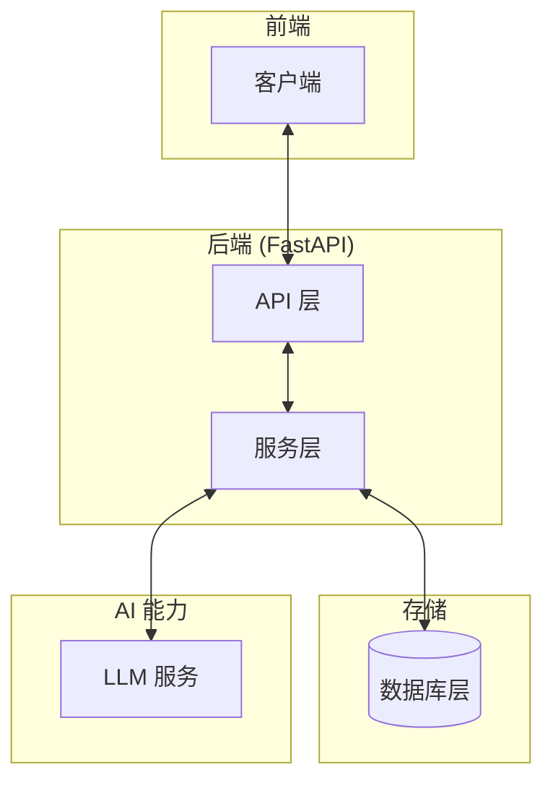

## 2. 核心组件

### 2.1 API 层

API 层负责处理客户端请求，进行请求验证、用户认证和路由分发。基于 FastAPI 框架实现，提供高性能的异步 API 接口。

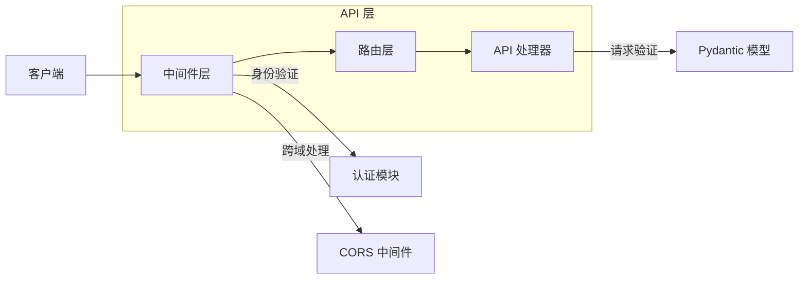

#### 主要路由模块：

- `/api/v1/auth` - 用户认证相关 API
- `/api/v1/questions` - 错题管理相关 API
- `/api/v1/knowledge` - 知识点相关 API
- `/api/v1/solving` - 智能解题相关 API
- `/api/v1/image` - 图像处理相关 API

### 2.2 服务层

服务层包含业务逻辑处理和应用程序核心功能实现。

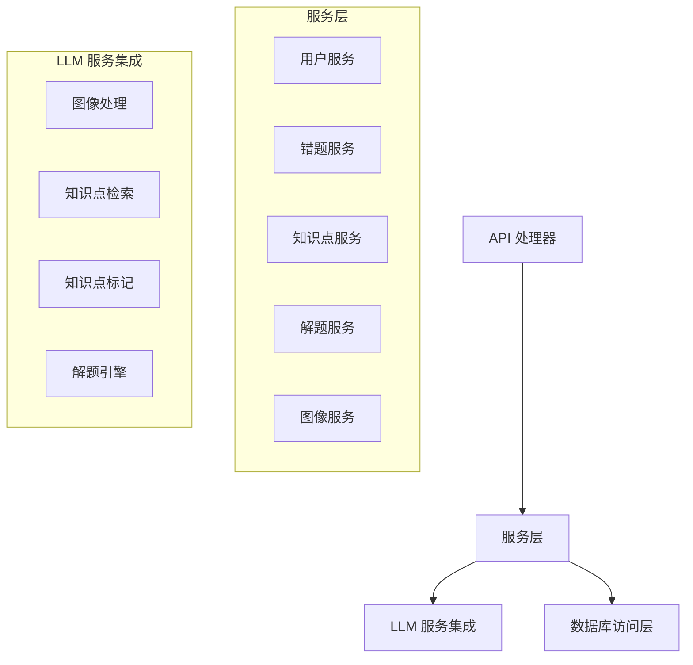

主要服务模块：

- **用户服务** (`user.py`): 用户管理与认证
- **错题服务** (`question.py`): 错题的 CRUD 操作
- **知识点服务** (`knowledge.py`): 知识点管理与检索
- **解题服务** (`solving.py`): 智能解题逻辑
- **图像服务** (`image.py`): 图像处理与文本提取

### 2.3 数据库层

系统使用 PostgreSQL 关系型数据库进行数据存储，通过 SQLAlchemy ORM 进行数据库交互。

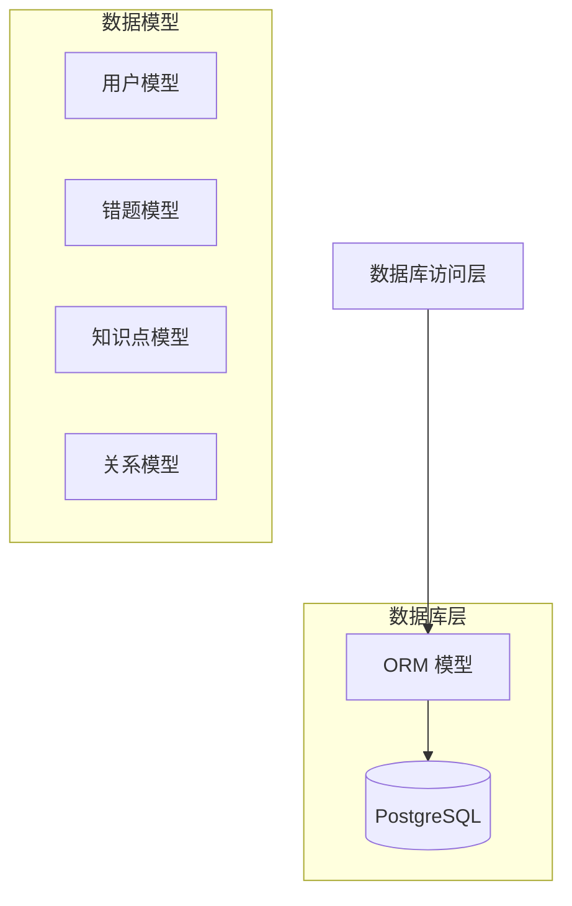

主要数据模型：

- **User** (`user.py`): 用户信息
- **Question** (`question.py`): 错题信息
- **Knowledge** (`knowledge.py`): 知识点信息及关系

### 2.4 LLM 服务集成

系统通过 LangChain 和 LangGraph 框架集成大型语言模型，提供智能解题、知识点提取等功能。

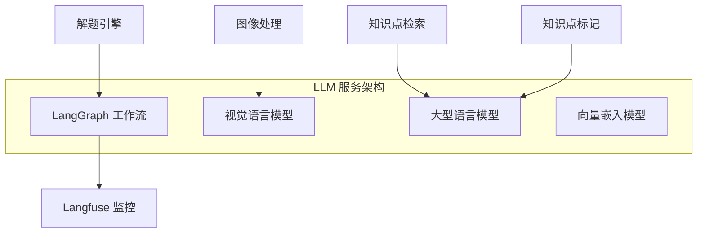

## 3. 数据流

### 3.1 错题处理流程

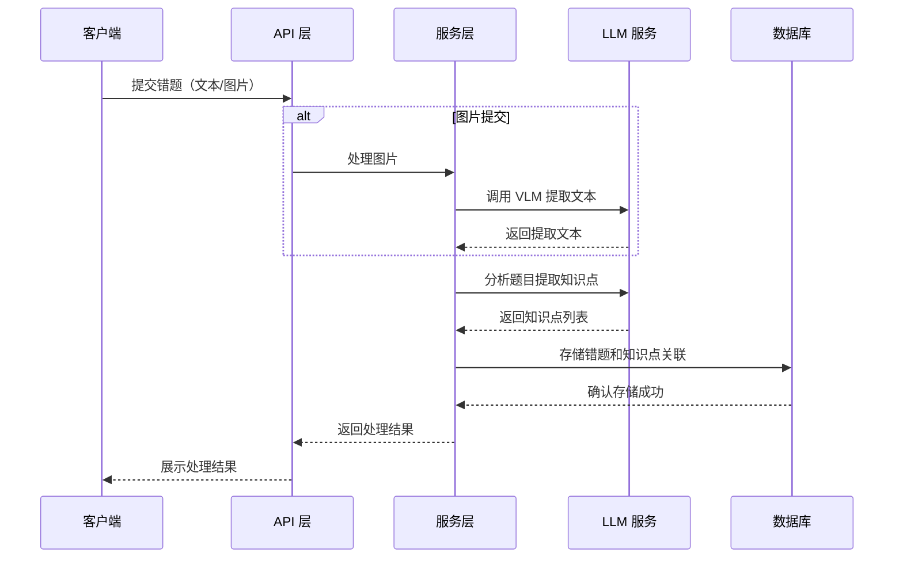

### 3.2 智能解题流程

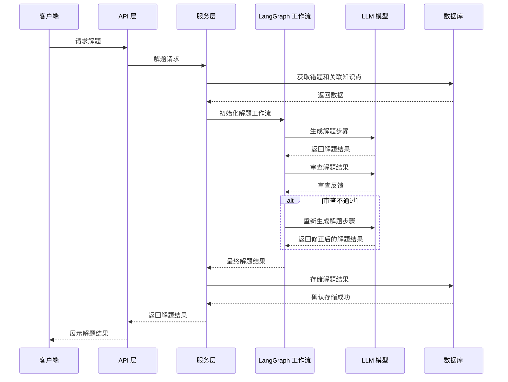

### 3.3 知识点标记流程

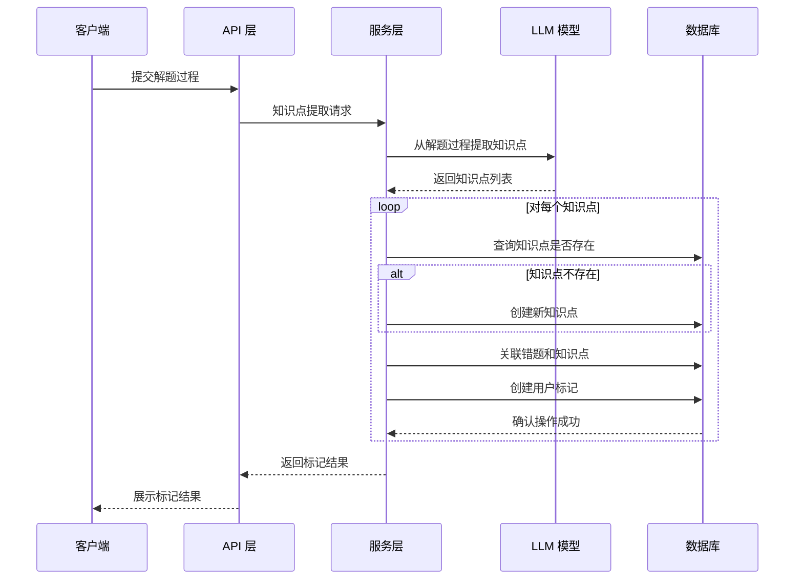

## 4. 技术栈

### 4.1 后端技术

- **Web 框架**: FastAPI
- **ORM**: SQLAlchemy
- **数据验证**: Pydantic
- **数据库**: PostgreSQL
- **认证**: JWT (JSON Web Tokens)
- **AI 集成**: LangChain, LangGraph
- **监控**: Langfuse
- **缓存**: Redis (可选)

### 4.2 LLM 技术

- **模型接入**: OpenAI 兼容接口
- **文本模型**: 支持任意兼容 OpenAI API 的 LLM 模型
- **视觉模型**: 支持兼容 OpenAI Vision API 的 VLM 模型
- **向量嵌入**: 支持兼容 OpenAI Embedding API 的嵌入模型

## 5. 扩展性设计

系统设计考虑了未来的扩展需求，支持以下扩展方向：

### 5.1 水平扩展

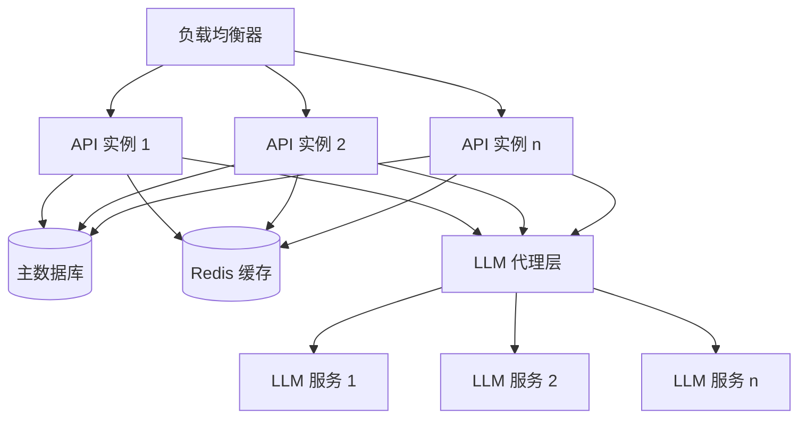

- 多个 API 实例实现负载均衡
- Redis 缓存减轻数据库压力
- LLM 代理层支持多种模型和服务提供商

### 5.2 功能扩展

系统设计为模块化架构，便于添加新功能和集成新服务：

- **新 AI 模型集成**: 松耦合设计允许轻松更换或添加新的 AI 模型
- **新业务功能**: 通过添加新的服务模块和 API 路由实现新功能
- **第三方集成**: 预留集成第三方服务的接口设计

## 6. 部署架构

### 6.1 开发环境

本地开发环境使用 Docker Compose 编排服务：

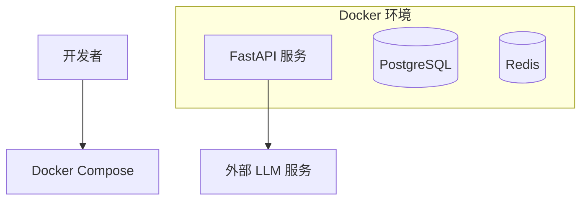

### 6.2 生产环境

生产环境建议使用 Kubernetes 编排服务，实现高可用和弹性扩展：

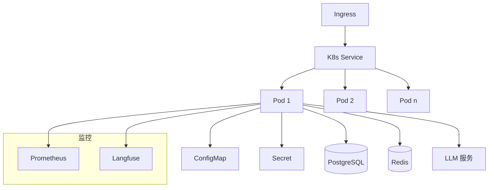

## 7. 安全架构

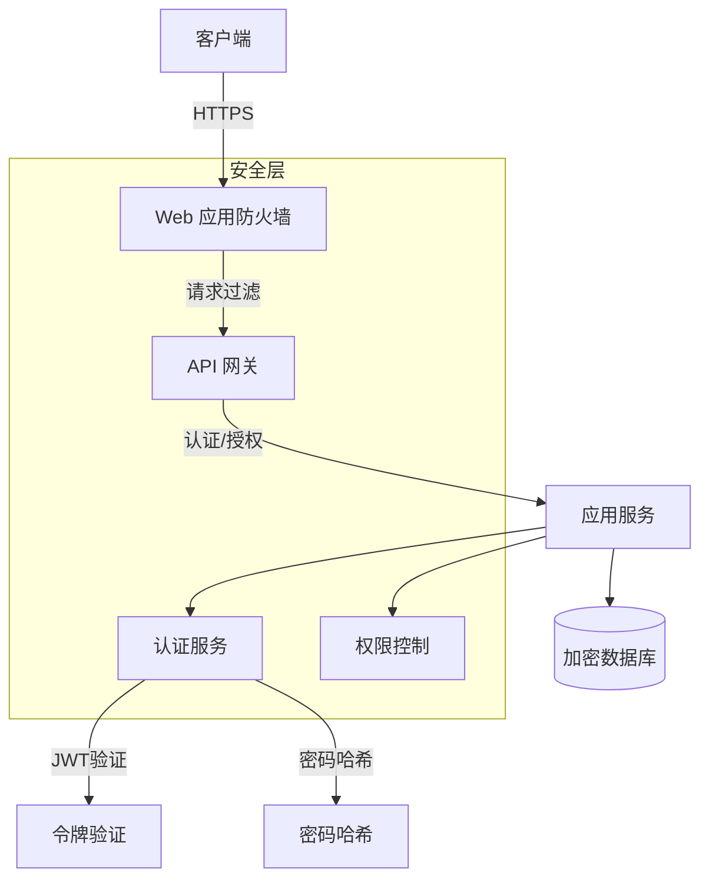

主要安全措施：

- **传输安全**: HTTPS 加密
- **认证授权**: JWT 基于角色的访问控制
- **密码安全**: 使用 bcrypt 哈希算法
- **输入验证**: 所有用户输入经过验证和清理
- **数据保护**: 敏感数据加密存储
- **环境隔离**: 配置通过环境变量管理
- **最小权限**: 实施最小权限原则

## 8. 监控与可观察性

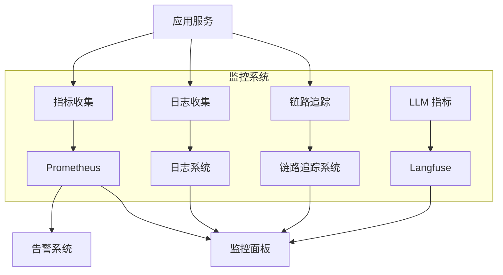

主要监控指标：

- **系统指标**: CPU、内存、磁盘使用率
- **API 指标**: 请求量、响应时间、错误率
- **数据库指标**: 查询性能、连接数
- **LLM 指标**: 调用次数、响应时间、成本、错误率
- **业务指标**: 用户活跃度、功能使用情况

## 9. 总结

GradNote 系统采用现代化的微服务架构设计，结合 FastAPI 和大型语言模型，为用户提供高效的错题知识点管理和智能解题功能。系统具有良好的可扩展性、安全性和可观察性，能够满足不同规模的使用需求。

核心优势：

- **高性能**: FastAPI 异步框架提供高并发处理能力
- **智能化**: 深度集成 LLM 提供智能解题和知识点提取能力
- **可扩展**: 模块化设计支持功能扩展和系统扩容
- **安全可靠**: 多层次安全架构保障数据和系统安全
- **可观察**: 完善的监控系统确保系统稳定运行
