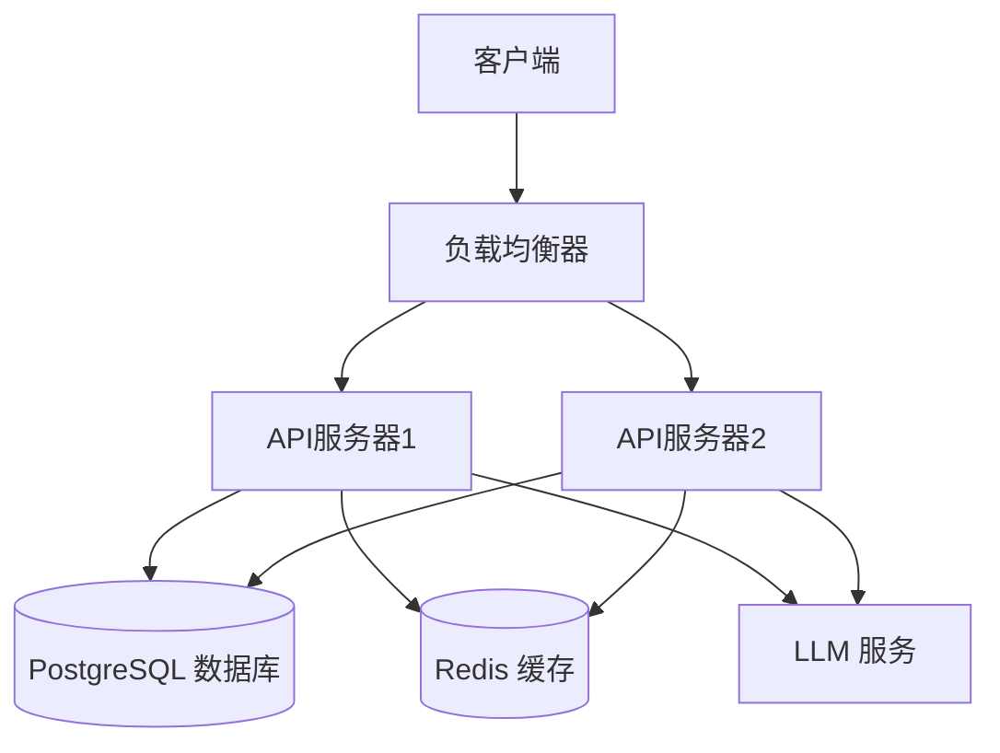
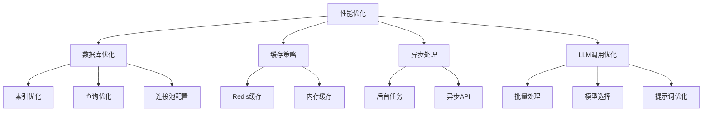
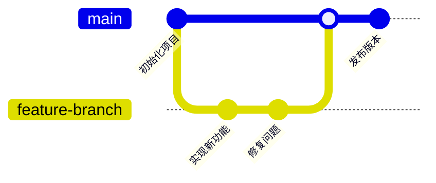

# GradNote 部署、开发、故障排除与贡献指南

## 目录

- [部署指南](#部署指南)
  - [开发环境部署](#开发环境部署)
  - [生产环境部署](#生产环境部署)
  - [环境变量配置](#环境变量配置)
- [开发指南](#开发指南)
  - [项目架构](#项目架构)
  - [代码风格](#代码风格)
  - [API开发流程](#api开发流程)
  - [数据库操作](#数据库操作)
  - [异常处理](#异常处理)
  - [测试指南](#测试指南)
- [故障排除](#故障排除)
  - [常见问题](#常见问题)
  - [日志查看](#日志查看)
  - [性能优化](#性能优化)
- [贡献指南](#贡献指南)
  - [开发流程](#开发流程)
  - [提交规范](#提交规范)
  - [代码审查](#代码审查)

## 部署指南

### 开发环境部署

#### 环境要求

- Python 3.13+
- PostgreSQL 17+（需启用pgvector扩展）
- Redis（可选，用于缓存）
- 兼容OpenAI API的LLM服务

#### 安装步骤

1. **克隆仓库**

```bash
git clone https://github.com/black-zero358/GradNote.git
cd GradNote
```

2. **安装依赖**

```bash
pip install -r backend/requirements.txt
```

主要依赖包括：
- FastAPI 0.115.12
- SQLAlchemy 2.0.40
- LangChain 0.3.23
- LangGraph
- Langfuse 2.60.2

3. **环境变量配置**

复制`.env.example`文件为`.env`并配置以下必要参数：

```
# 数据库配置
POSTGRES_SERVER=localhost
POSTGRES_USER=postgres
POSTGRES_PASSWORD=your_password
POSTGRES_DB=GradNote
POSTGRES_PORT=5432

# 安全配置
SECRET_KEY=your_generated_secret_key_here

# LLM设置
OPENAI_API_KEY=your_api_key
OPENAI_API_BASE=your_api_base_url
```

4. **初始化数据库**

```bash
cd backend
python -m app.db.create_tables
```

5. **启动开发服务器**

```bash
uvicorn app.main:app --reload --host 0.0.0.0 --port 8000
```

6. **验证安装**

访问 http://localhost:8000/docs 查看API文档界面，确认服务正常运行。

### 生产环境部署

#### 使用Docker部署

1. **构建Docker镜像**

```bash
# 构建Docker镜像
docker build -t gradnote-backend .

# 运行容器
docker run -d -p 8000:8000 \
  --env-file .env \
  --name gradnote-backend \
  gradnote-backend
```

#### 使用Docker Compose部署

创建`docker-compose.yml`文件：

```yaml
version: '3'
services:
  backend:
    build: ./backend
    ports:
      - "8000:8000"
    env_file:
      - .env
    depends_on:
      - db
    volumes:
      - ./uploads:/app/uploads

  db:
    image: postgres:17
    environment:
      - POSTGRES_USER=${POSTGRES_USER}
      - POSTGRES_PASSWORD=${POSTGRES_PASSWORD}
      - POSTGRES_DB=${POSTGRES_DB}
    volumes:
      - postgres_data:/var/lib/postgresql/data

volumes:
  postgres_data:
```

启动服务：

```bash
docker-compose up -d
```

#### 部署架构



### 环境变量配置

生产环境需要配置以下环境变量：

```
# 数据库配置
POSTGRES_SERVER=db
POSTGRES_USER=postgres
POSTGRES_PASSWORD=secure_password
POSTGRES_DB=GradNote
POSTGRES_PORT=5432

# 安全配置
SECRET_KEY=complex_random_string
ACCESS_TOKEN_EXPIRE_MINUTES=1440  # 24小时

# CORS配置
BACKEND_CORS_ORIGINS=["https://yourdomain.com"]

# LLM配置
OPENAI_API_KEY=your_api_key
OPENAI_API_BASE=your_api_base
OPENAI_LLM_MODEL=your_model
OPENAI_VLM_MODEL=your_vision_model
OPENAI_EMBEDDING_MODEL=your_embedding_model

# 服务配置
DEBUG=false
WORKERS=4
API_PORT=8000
API_HOST=0.0.0.0
UPLOAD_DIR=uploads
```

## 开发指南

### 项目架构

GradNote后端采用模块化架构，主要组件如下：

```mermaid
graph TD
    A[main.py] --> B[api]
    A --> C[core]
    A --> D[db]
    A --> E[llm_services]
    A --> F[models]
    A --> G[services]
    
    B --> B1[deps.py]
    B --> B2[routes]
    B --> B3[schemas]
    
    C --> C1[config.py]
    C --> C2[security.py]
    
    D --> D1[session.py]
    D --> D2[create_tables.py]
    D --> D3[init_db.py]
    D --> D4[create_index.py]
    D --> D5[reset_sequence.py]
    
    E --> E1[image_processing]
    E --> E2[knowledge_mark]
    E --> E3[knowledge_retriever]
    E --> E4[solving]
    
    F --> F1[user.py]
    F --> F2[question.py]
    F --> F3[knowledge.py]
    
    G --> G1[user.py]
    G --> G2[image.py]
    G --> G3[knowledge.py]
    G --> G4[knowledge_marking.py]
    G --> G5[solving.py]
```



模块说明：
- **api**: 定义所有HTTP接口，包括路由、请求/响应模型
- **core**: 核心配置和安全相关功能
- **db**: 数据库连接和初始化
- **llm_services**: AI模型集成，包括图像处理、知识点提取、解题等
- **models**: SQLAlchemy数据库模型
- **services**: 业务逻辑层，连接API和数据库

### 代码风格

- 遵循PEP 8规范
- 使用类型注解
- 函数和类添加文档字符串
- 变量和函数使用小写下划线命名法
- 类使用驼峰命名法

**示例：**

```python
from typing import List, Optional
from sqlalchemy.orm import Session

def get_user_by_id(db: Session, user_id: int) -> Optional[User]:
    """
    通过ID获取用户信息
    
    参数:
        db: 数据库会话
        user_id: 用户ID
        
    返回:
        找到的用户对象或None
    """
    return db.query(User).filter(User.id == user_id).first()
```

### API开发流程


1. 在`app/api/schemas`中定义请求和响应模型
2. 在`app/services`中实现业务逻辑
3. 在`app/api/routes`中定义API路由
4. 更新`app/api/routes/api.py`注册新路由
5. 编写测试用例
6. 更新API文档

**示例：添加新API端点**

1. **定义请求和响应模型**

```python
# app/api/schemas/knowledge.py
from pydantic import BaseModel
from typing import List, Optional

class KnowledgeCreate(BaseModel):
    subject: str
    chapter: str
    section: str
    item: str
    details: str

class KnowledgeResponse(BaseModel):
    id: int
    subject: str
    chapter: str
    section: str
    item: str
    details: str
    mark_count: int
    
    class Config:
        from_attributes = True
```

2. **实现业务逻辑**

```python
# app/services/knowledge.py
from sqlalchemy.orm import Session
from app.models.knowledge import KnowledgePoint
from app.api.schemas.knowledge import KnowledgeCreate

def create_knowledge_point(db: Session, knowledge: KnowledgeCreate):
    db_knowledge = KnowledgePoint(
        subject=knowledge.subject,
        chapter=knowledge.chapter,
        section=knowledge.section,
        item=knowledge.item,
        details=knowledge.details,
        mark_count=0
    )
    db.add(db_knowledge)
    db.commit()
    db.refresh(db_knowledge)
    return db_knowledge
```

3. **定义API路由**

```python
# app/api/routes/knowledge.py
from fastapi import APIRouter, Depends, HTTPException
from sqlalchemy.orm import Session
from typing import List

from app.api.deps import get_db
from app.services import knowledge as knowledge_service
from app.api.schemas.knowledge import KnowledgeCreate, KnowledgeResponse

router = APIRouter()

@router.post("/", response_model=KnowledgeResponse)
def create_knowledge_point(
    knowledge: KnowledgeCreate, 
    db: Session = Depends(get_db)
):
    return knowledge_service.create_knowledge_point(db, knowledge)
```

4. **注册路由**

```python
# app/api/routes/api.py
from fastapi import APIRouter
from app.api.routes import knowledge, user, question, solving

api_router = APIRouter()
api_router.include_router(knowledge.router, prefix="/knowledge", tags=["knowledge"])
# ... 其他路由
```

### 数据库操作

使用SQLAlchemy ORM进行数据库操作：

```python
# 创建
db_item = Model(attr1=value1, attr2=value2)
db.add(db_item)
db.commit()
db.refresh(db_item)

# 查询
items = db.query(Model).filter(Model.attr == value).all()

# 更新
db_item = db.query(Model).filter(Model.id == item_id).first()
db_item.attr = new_value
db.commit()

# 删除
db_item = db.query(Model).filter(Model.id == item_id).first()
db.delete(db_item)
db.commit()
```

### 异常处理

使用FastAPI的HTTPException处理API错误：

```python
from fastapi import HTTPException, status

if not item:
    raise HTTPException(
        status_code=status.HTTP_404_NOT_FOUND,
        detail="Item not found"
    )
```

自定义错误响应格式：

```python
# 定义错误代码
class ErrorCode:
    ITEM_NOT_FOUND = "ITEM_NOT_FOUND"
    UNAUTHORIZED = "UNAUTHORIZED"
    VALIDATION_ERROR = "VALIDATION_ERROR"

# 使用错误代码
if not item:
    raise HTTPException(
        status_code=status.HTTP_404_NOT_FOUND,
        detail={
            "message": "资源不存在",
            "error_code": ErrorCode.ITEM_NOT_FOUND
        }
    )
```

### 测试指南

使用pytest进行单元测试和集成测试：

```bash
# 运行所有测试
pytest

# 运行特定测试文件
pytest tests/test_api.py

# 运行特定测试函数
pytest tests/test_api.py::test_create_user
```

**测试结构示例：**

```
tests/
├── conftest.py              # 测试配置和固定装置
├── unit/                    # 单元测试
│   ├── test_services.py     # 服务层测试
│   └── test_models.py       # 数据模型测试
└── integration/             # 集成测试
    ├── test_api_auth.py     # 认证API测试
    ├── test_api_knowledge.py # 知识点API测试
    └── test_api_questions.py # 错题API测试
```

**测试示例：**

```python
# tests/integration/test_api_auth.py
from fastapi.testclient import TestClient
import pytest
from app.main import app

client = TestClient(app)

def test_login_success():
    response = client.post(
        "/api/v1/auth/login",
        json={"username": "testuser", "password": "password"}
    )
    assert response.status_code == 200
    data = response.json()
    assert "access_token" in data
    assert data["token_type"] == "bearer"
```

## 故障排除

### 常见问题

#### 数据库连接问题

**问题**：数据库连接失败
**解决方案**：
- 检查数据库服务是否运行
- 验证数据库连接参数
- 确认网络连接

```bash
# 检查PostgreSQL服务状态
systemctl status postgresql

# 验证连接参数
psql -h localhost -U postgres -d GradNote
```

#### LLM API调用问题

**问题**：LLM API调用失败
**解决方案**：
- 检查API密钥是否正确
- 验证API基础URL
- 检查网络连接
- 查看API服务提供商状态

```python
# 测试LLM API连接
import os
import openai
from dotenv import load_dotenv

load_dotenv()
openai.api_key = os.getenv("OPENAI_API_KEY")
openai.base_url = os.getenv("OPENAI_API_BASE")

try:
    response = openai.chat.completions.create(
        model="your_model_name",
        messages=[{"role": "user", "content": "Hello"}]
    )
    print("API正常工作")
except Exception as e:
    print(f"API错误: {e}")
```

#### 图像处理问题

**问题**：图像处理失败
**解决方案**：
- 检查图像格式是否支持
- 验证图像大小是否超过限制
- 确认VLM模型配置正确

```bash
# 检查图像处理相关配置
grep -r "VLM" .env
```

### 日志查看

系统使用Python标准日志模块记录日志：

```bash
# 查看应用日志
tail -f app.log

# 在Docker环境中查看日志
docker logs gradnote-backend
```

配置日志级别（在`.env`文件中）：

```
LOG_LEVEL=debug  # debug, info, warning, error, critical
```

### 性能优化



1. **使用Redis缓存频繁访问的数据**

```python
import redis
from functools import lru_cache

redis_client = redis.Redis(host='localhost', port=6379, db=0)

def get_knowledge_point(knowledge_id: int):
    # 尝试从缓存获取
    cache_key = f"knowledge:{knowledge_id}"
    cached_data = redis_client.get(cache_key)
    
    if cached_data:
        return json.loads(cached_data)
    
    # 从数据库获取
    db_data = db.query(KnowledgePoint).filter(KnowledgePoint.id == knowledge_id).first()
    
    # 存入缓存
    redis_client.setex(
        cache_key,
        3600,  # 过期时间1小时
        json.dumps(db_data.__dict__)
    )
    
    return db_data
```

2. **优化数据库查询**

- 使用适当的索引
- 减少不必要的连接查询
- 限制结果集大小
- 使用异步查询

3. **使用异步处理长时间运行的任务**

```python
import asyncio

async def process_image_async(image_data):
    # 耗时操作
    result = await asyncio.to_thread(process_image_sync, image_data)
    return result
```

4. **监控LLM调用性能**

- 使用Langfuse跟踪LLM调用
- 分析响应时间和成本
- 优化提示词设计

## 贡献指南

### 开发流程



1. **Fork仓库**

在GitHub上Fork主仓库到您的账户。

2. **克隆仓库**

```bash
git clone https://github.com/YOUR-USERNAME/GradNote.git
cd GradNote
```

3. **创建功能分支**

```bash
git checkout -b feature/your-feature-name
```

4. **提交更改**

```bash
git add .
git commit -m "feat: 添加新功能"
```

5. **推送分支**

```bash
git push origin feature/your-feature-name
```

6. **创建Pull Request**

在GitHub界面创建Pull Request，并等待审查。

### 提交规范

使用约定式提交格式：

```
<类型>(<范围>): <描述>

[可选的正文]

[可选的脚注]
```

类型包括：
- **feat**: 新功能
- **fix**: 修复bug
- **docs**: 文档更新
- **style**: 代码风格更改
- **refactor**: 代码重构
- **perf**: 性能优化
- **test**: 测试相关
- **chore**: 构建过程或辅助工具变动

**示例：**

```
feat(knowledge): 添加知识点搜索功能

添加了基于向量相似度的知识点搜索API，使用pgvector扩展实现。

Closes #123
```

### 代码审查

- 所有代码变更需要通过代码审查
- 确保代码符合项目风格
- 验证功能正常工作
- 检查测试覆盖率

**代码审查清单：**

- [ ] 代码是否遵循PEP 8风格指南？
- [ ] 是否添加了适当的文档字符串？
- [ ] 是否添加了单元测试？
- [ ] 是否存在安全隐患？
- [ ] 是否有性能问题？
- [ ] API设计是否符合RESTful原则？
- [ ] 错误处理是否完善？
