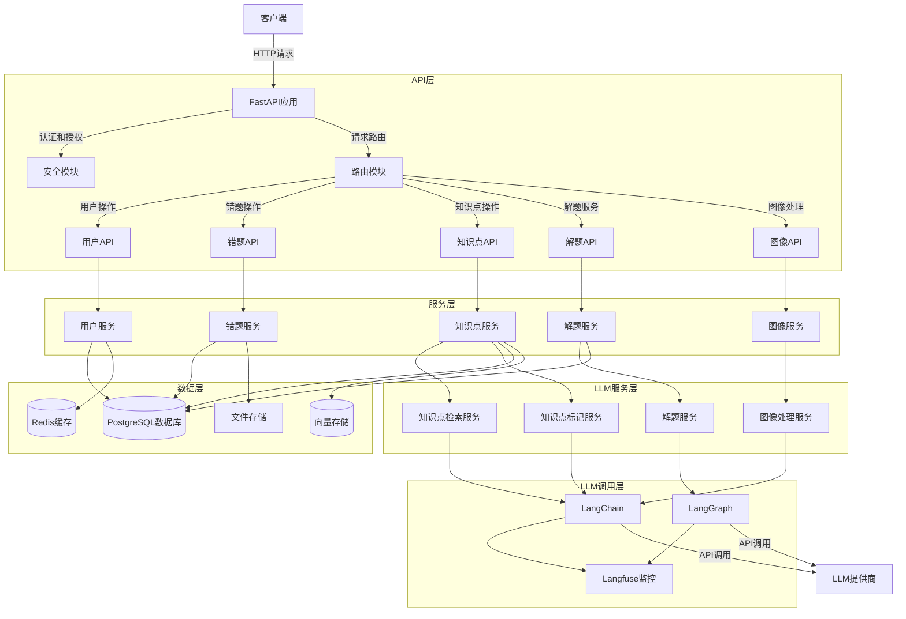
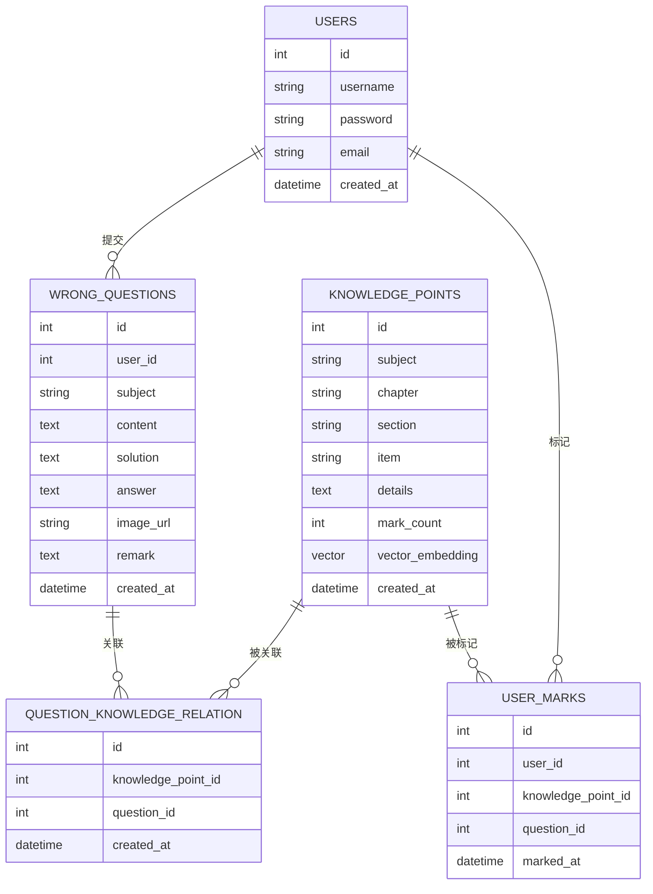
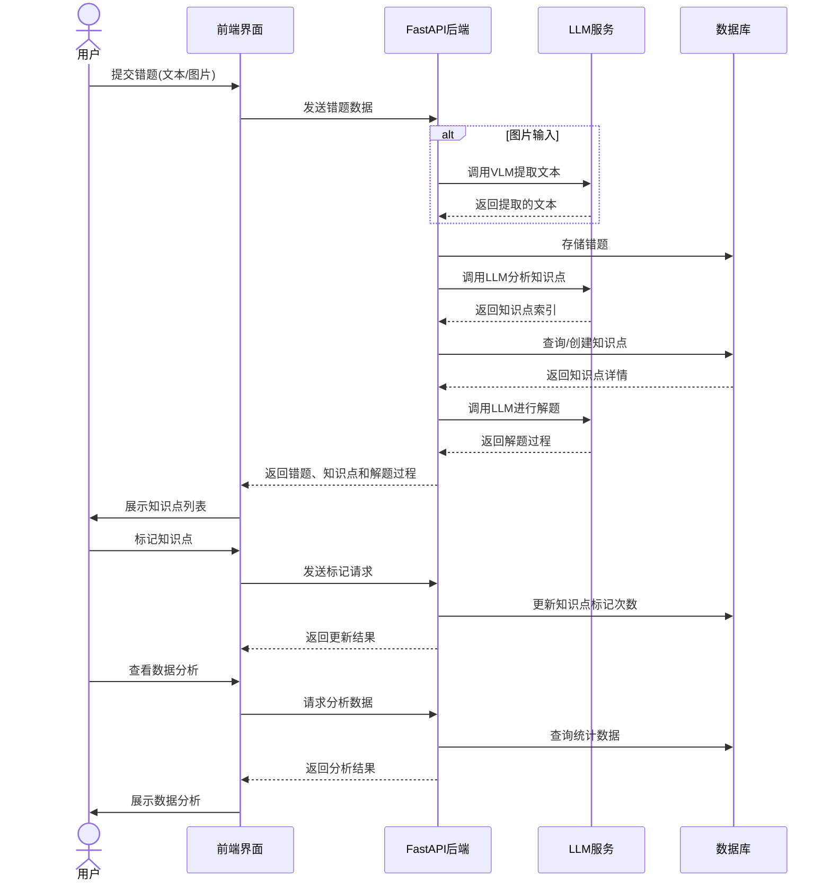
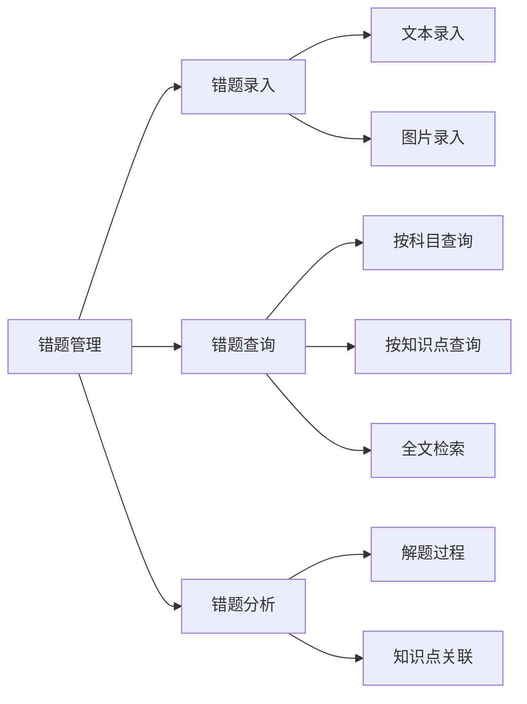
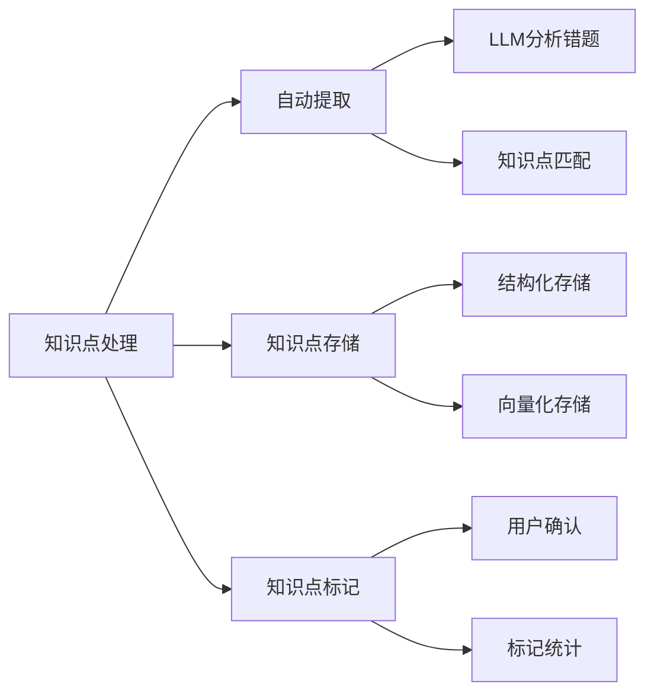
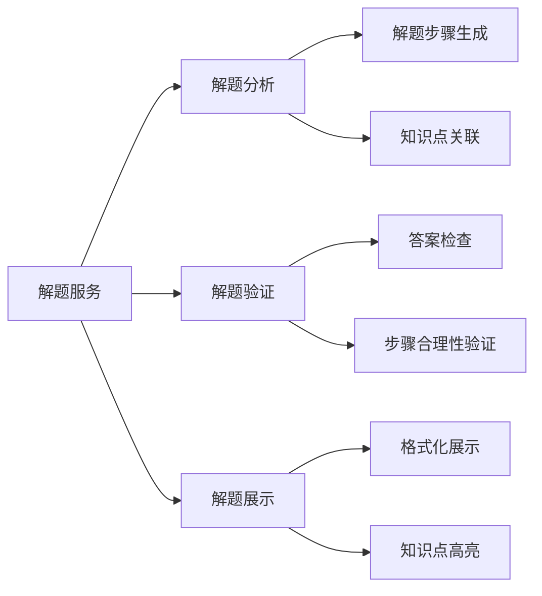

# GradNote错题知识点管理系统

## 1. 项目简介

GradNote是一个基于FastAPI和大型语言模型(LLM)的错题知识点管理系统，旨在帮助学生高效管理和学习错题。系统通过AI技术分析错题，提取知识点，并提供智能解题功能，帮助学生理解和掌握相关知识点。

系统的核心功能包括：
- 错题管理：支持多种格式错题录入（文本、图片）
- 知识点提取：自动从错题中提取关键知识点
- 知识点标记：用户可确认和标记知识点
- 智能解题：基于知识点提供解题思路和步骤
- 学习情况分析：提供学习情况的数据分析

### 1.1 项目结构

```
GradNote
│
├── backend/                 # 后端服务
│   ├── app/                 # 应用主目录
│   │   ├── api/             # API路由模块
│   │   │   ├── routes/      # 路由定义
│   │   │   ├── schemas/     # Pydantic模型
│   │   │   └── deps.py      # API依赖项
│   │   │
│   │   ├── core/            # 核心配置
│   │   │   ├── config.py    # 配置管理
│   │   │   └── security.py  # 安全配置
│   │   │
│   │   ├── db/              # 数据库模块
│   │   │   ├── create_tables.py # 创建表
│   │   │   ├── init_db.py   # 初始化数据
│   │   │   ├── create_index.py # 创建索引
│   │   │   ├── reset_sequence.py # 重置序列
│   │   │   └── session.py   # 会话管理
│   │   │
│   │   ├── llm_services/    # LLM服务
│   │   │   ├── image_processing/ # 图像处理
│   │   │   ├── knowledge_mark/ # 知识点标记
│   │   │   ├── knowledge_retriever/ # 知识点检索
│   │   │   └── solving/     # 解题服务
│   │   │
│   │   ├── models/          # 数据模型
│   │   │   ├── user.py      # 用户模型
│   │   │   ├── question.py  # 错题模型
│   │   │   └── knowledge.py # 知识点模型
│   │   │
│   │   ├── services/        # 业务服务
│   │   │   ├── user.py      # 用户服务
│   │   │   ├── knowledge.py # 知识点服务
│   │   │   ├── solving.py   # 解题服务
│   │   │   └── image.py     # 图像服务
│   │   │
│   │   └── main.py          # 应用入口
│   │
│   ├── requirements.txt     # 依赖
│   ├── .env.example         # 环境变量示例
│   └── uploads/             # 上传文件目录
```

## 2. 技术架构

### 2.1 核心技术栈

- **后端框架**：FastAPI 0.115.12 - 高性能异步API框架
- **数据库**：PostgreSQL + pgvector - 支持向量存储的关系型数据库
- **ORM**：SQLAlchemy 2.0.40 - Python的SQL工具包和ORM
- **数据验证**：Pydantic 2.11.3 - 数据验证和设置管理
- **AI模型集成**：
  - LangChain 0.3.23 - LLM应用开发框架
  - LangGraph - 基于LangChain的智能流程编排
  - Langfuse 2.60.2 - LLM应用监控平台
- **缓存**：Redis 5.0.1 - 用于缓存频繁访问的数据

### 2.2 系统架构图



### 2.3 数据模型关系图



### 2.4 用户操作流程图



## 3. 数据模型设计

### 3.1 核心数据模型

- **用户模型 (User)**：存储用户基本信息和认证数据
- **错题模型 (WrongQuestion)**：存储用户提交的错题信息
- **知识点模型 (KnowledgePoint)**：存储结构化的知识点信息
- **题目-知识点关联 (QuestionKnowledgeRelation)**：记录题目与知识点的关联
- **用户标记记录 (UserMark)**：记录用户对知识点的标记

### 3.2 数据关系

- 用户可以提交多个错题
- 每个错题可以关联多个知识点
- 用户可以标记多个知识点
- 知识点可以被多个用户标记
- 知识点可以关联多个错题

## 4. 核心功能模块

### 4.1 错题管理



### 4.2 知识点提取与标记



### 4.3 智能解题



### 4.4 图像处理

- OCR识别题目文本
- 公式和特殊符号识别
- 图像内容解析

### 4.5 用户管理

- 用户注册与认证
- 权限管理
- 用户配置与偏好设置

## 5. 环境配置

### 5.1 环境要求

- Python 3.13+
- PostgreSQL 17+ (需启用pgvector扩展)
- Redis (可选，用于缓存)
- 兼容OpenAI API的LLM服务

### 5.2 关键配置项

环境变量`.env`文件中包含以下主要配置项：

- 数据库连接配置
- Redis配置
- 安全密钥
- LLM服务API密钥和URL
- 模型参数和提示词配置
- 服务运行配置

## 6. 安装与部署

### 6.1 基本安装步骤

1. 克隆代码库
2. 安装依赖：`pip install -r backend/requirements.txt`
3. 配置环境变量
4. 初始化数据库：`python -m app.db.create_tables`
5. 启动服务：`uvicorn app.main:app --reload`

### 6.2 生产环境部署

生产环境部署时，建议：
- 使用Gunicorn作为WSGI服务器
- 配置Nginx作为反向代理
- 使用PostgreSQL的生产配置
- 设置适当的安全措施
- 配置监控和日志系统

## 7. API接口概览

系统提供完整的RESTful API，主要包括：

- 用户认证接口
- 错题管理接口
- 知识点操作接口
- 解题服务接口
- 图像处理接口

API文档可通过访问`/docs`或`/redoc`查看。
