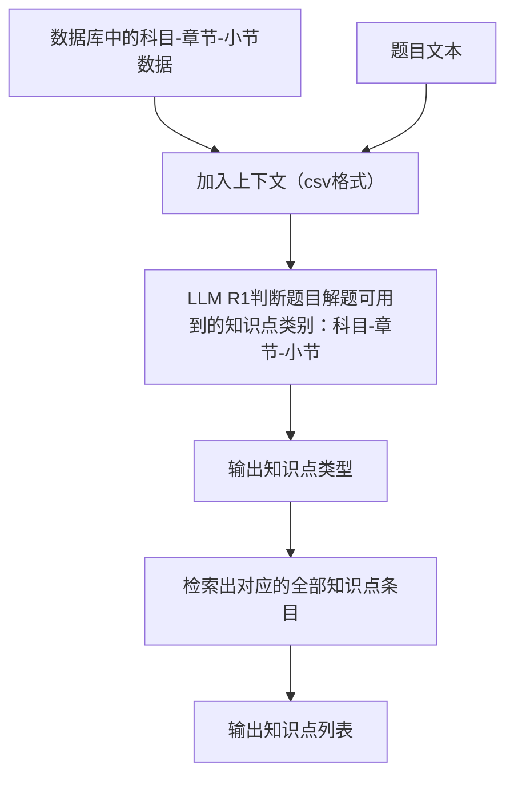
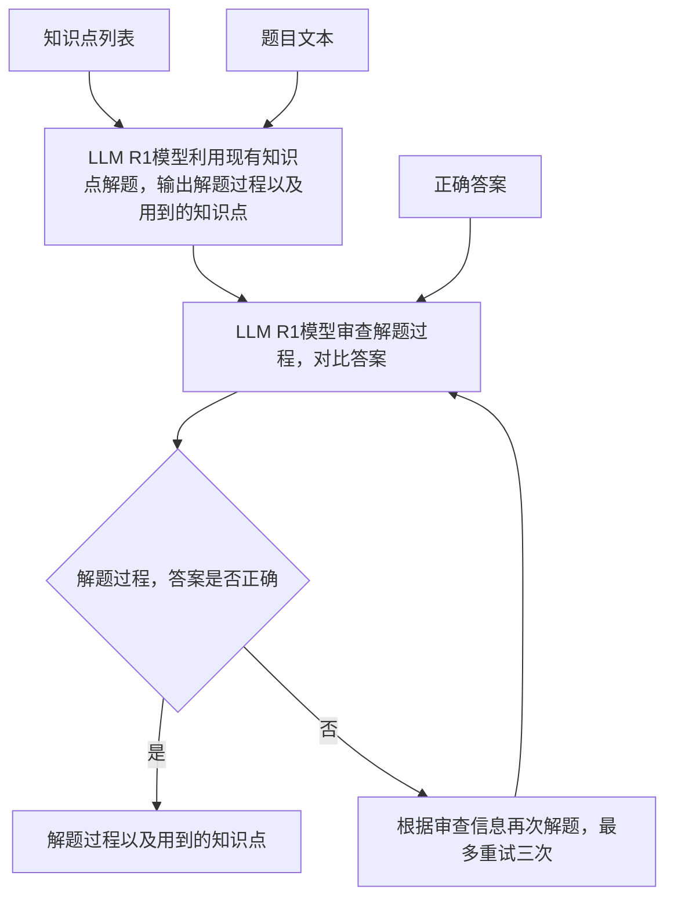
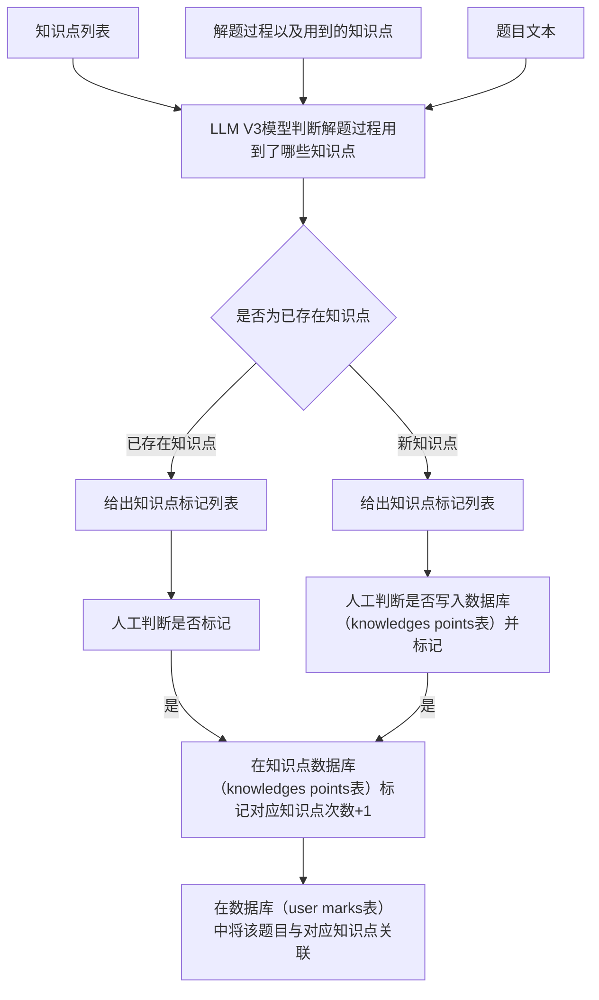

# GradNote - 错题知识点管理系统后端开发路线图

## 实施进度摘要 

- ✅ 阶段1: Langfuse集成与基础设施 - 已完成
- ✅ 阶段2: 知识点检索模块 - 已完成
- ⏳ 阶段3: 解题模块 - 待实施
- ✅ 阶段4: 知识点标记模块 - 已完成
- ⏳ 阶段5: API版本化与测试 - 待实施

## 重构计划 (Version 2.0)

### 背景与目标

基于现有的GradNote-v1后端代码，我们需要重构系统以实现更高效的流程，具体包括：

1. 优化知识点检索流程
2. 增强LLM解题工作流
3. 改进知识点标记机制
4. 集成Langfuse监控所有LLM调用

### 系统架构流程图

#### 知识点检索模块 (v2)


#### 解题模块 (v2)


#### 知识点标记模块 (v2)


### 1. API结构调整 (`/backend/app/api/`)

#### 1.1 版本化接口
- 保留现有接口以确保向后兼容

#### 1.2 知识点模块 (`/api/v1/knowledge`)
- **新增 `POST /analyze-from-question`** ✅
  - 实现题目文本分析，返回可能的知识点类别
  - Schema: `KnowledgeAnalyzeRequest`, `KnowledgeAnalyzeResponse`


- **优化 `GET /search`** ✅
  - 基于现有知识点检索功能优化查询性能
  - 支持按科目、章节、小节多维度检索

- **新增 `POST /extract-from-solution`** ✅
  - 实现从解题过程中提取使用的知识点
  - 区分"已有知识点"和"新知识点"
  - Schema: `KnowledgeExtractRequest`, `KnowledgeExtractResponse`

- **新增 `POST /mark-confirmed`** ✅
  - 实现用户确认知识点标记的功能
  - 处理已有知识点标记和新知识点创建
  - Schema: `KnowledgeMarkRequest`, `KnowledgeMarkResponse`

#### 1.3 解题模块 (`/api/v1/solving`)
- **重构 `POST /solve`**
  - 使用LangGraph优化解题流程
  - 添加审查和重试机制
  - Schema: `SolveRequest`, `SolveResponse`


### 2. 数据模型 (`/backend/app/models/`)

已经有完善的数据模型，基本保持现状：

- **`KnowledgePoint`**: 已包含 `mark_count` 字段
- **`QuestionKnowledgeRelation`**: 已存在关联表
- **`UserMark`**: 已存在用户标记表
- **`WrongQuestion`**: 错题表已完善

### 3. LLM服务层 (`/backend/app/llm_services/`)


#### 3.2 知识点检索服务 ✅
- **创建 `knowledge_retriever/`** ✅
  - `__init__.py`
  - `retriever.py`: 实现 `LLMKnowledgeRetriever` 类
    - `analyze_knowledge_category()`: 分析题目所属知识点类别

#### 3.3 解题工作流
- **重构 `solving/workflow.py`**
  - 使用LangGraph实现完整解题流程
  - 实现 `LLMSolvingWorkflow` 类替代现有 `SolveWorkflow`
  - 包含解题、审查和重试节点

#### 3.4 知识点提取
- **增强 `knowledge_mark/extractor.py`** ✅
  - 增强 `KnowledgeExtractor` 类 ✅
  - 实现解题过程知识点提取 ✅
  - 区分已有知识点和新知识点 ✅

### 4. 服务层 (`/backend/app/services/`)

#### 4.1 知识点服务 ✅
- **优化 `knowledge.py`** ✅
  - 添加 `get_all_categories_csv()`: 获取知识点类别CSV ✅
  - 优化 `search_knowledge_points()`: 多条件查询 ✅

#### 4.2 知识点标记服务
- **创建 `knowledge_marking.py`** ✅
  - 实现 `apply_confirmed_markings()`: 处理用户确认的知识点标记 ✅
  - 处理新知识点创建和关联 ✅

#### 4.3 解题服务
- **重构 `solving.py`**
  - 简化现有方法
  - 添加与LLM工作流的协调逻辑

### 5. 实施计划

分阶段实施重构，确保系统稳定性：


#### 阶段2: 知识点检索模块 ✅ 
- 实现知识点类别分析
  - ✅ 创建LLMKnowledgeRetriever类
  - ✅ 实现analyze_knowledge_category方法
  - ✅ 创建知识点类别CSV转换功能
- 优化知识点检索
  - ✅ 添加/analyze-from-question API端点
  - ✅ 创建相关Schema


#### 阶段3: 解题模块
- 重构解题工作流
- 添加审查和重试机制


#### 阶段4: 知识点标记模块 ✅
- 实现知识点提取增强
  - ✅ 增强KnowledgeExtractor类
  - ✅ 添加extract_knowledge_points_from_solution方法
  - ✅ 区分已有知识点和新知识点
- 开发人工确认流程
  - ✅ 创建knowledge_marking服务
  - ✅ 实现apply_confirmed_markings函数
  - ✅ 添加/extract-from-solution API端点
  - ✅ 添加/mark-confirmed API端点
  - ✅ 创建相关Schema


#### 阶段5: API版本化与测试
- 创建v1版本API
- 全面测试所有功能


### 6. 代码示例

#### 知识点检索示例 ✅
```python
# app/llm_services/knowledge_retriever/retriever.py
import json
from typing import List, Dict
from app.llm_services.base import get_llm

class LLMKnowledgeRetriever:
    def __init__(self, llm=None):
        self.llm = llm or get_llm()
        
    
    def analyze_knowledge_category(self, question_text: str, categories_csv: str) -> List[Dict[str, str]]:
        """分析题目所属的知识点类别"""
        
        prompt = f"""分析以下题目，确定其所属的科目、章节和小节。
        题目：{question_text}
        
        参考以下知识点类别 (CSV格式):
        {categories_csv}
        
        请以JSON格式返回可能相关的知识点类别列表：
        [
            {{"subject": "科目名称", "chapter": "章节名称", "section": "小节名称"}}
        ]
        """
        
        response = self.llm.invoke(prompt)
        
        # 解析JSON响应
        try:
            result = json.loads(response.content)
            return result if isinstance(result, list) else []
        except json.JSONDecodeError:
            return []
```

#### 解题工作流示例
**注意：解题工作流需要重构，目前只是参考示例**
```python
# app/llm_services/solving/workflow.py
from typing import Dict, List, Optional, Literal, TypedDict
from langgraph.graph import StateGraph, END
from app.llm_services.base import get_llm
from langfuse.callback import CallbackHandler

class SolveState(TypedDict):
    """解题工作流状态类型"""
    question: str
    knowledge_points: List[str]
    correct_answer: Optional[str]
    solution: Optional[str]
    review_passed: Optional[bool]
    review_reason: Optional[str] 
    attempts: int

class LLMSolvingWorkflow:
    def __init__(self, llm=None):
        self.llm = llm or get_llm()
        
        self.graph = self._build_graph()
    
    # 解题节点实现...
    
    # 审查节点实现...
    
    # 条件路由实现...
    
    def _build_graph(self) -> StateGraph:
        workflow = StateGraph(SolveState)
        
        # 添加节点
        workflow.add_node("solve", self._solve_node)
        workflow.add_node("review", self._review_node)
        
        # 添加边
        workflow.add_edge("solve", "review")
        workflow.add_conditional_edges(
            "review",
            self._should_retry,
            {
                "end": END,
                "retry": "solve"
            }
        )
        
        # 设置入口节点
        workflow.set_entry_point("solve")
        
        return workflow.compile()
    
    def invoke(self, initial_state: Dict) -> SolveState:
        """运行解题工作流"""
        return self.graph.invoke(initial_state)
```


### 7. 技术栈 

- **Web框架**: FastAPI
- **ORM**: SQLAlchemy
- **LLM工具链**: LangChain, LangGraph
- **监控**: Langfuse
- **主要模型**: DeepSeek R1、DeepSeek V3

### 8. 预期收益

- 提高用户体验: 更准确的知识点检索和更高质量的解题
- 降低系统耦合性: 更模块化的设计
- 提高可维护性: 更清晰的职责分离
- 监控能力: 通过Langfuse实现LLM调用的完整可观测性

### 9. 最近更新 (2023-04-06)

#### 知识点标记模块完成

完成了知识点标记模块的开发工作，包括以下功能：

1. **新增Schema类**:
   - `KnowledgePointInfo`: 知识点信息模型
   - `KnowledgeExtractRequest`/`KnowledgeExtractResponse`: 知识点提取请求和响应模型
   - `KnowledgeMarkRequest`/`KnowledgeMarkResponse`: 知识点标记确认请求和响应模型

2. **增强KnowledgeExtractor类**:
   - 新增`extract_knowledge_points_from_solution`方法，从解题过程中提取知识点
   - 区分已有知识点和新发现的知识点

3. **新增知识点标记服务**:
   - 创建`knowledge_marking.py`服务模块
   - 实现`apply_confirmed_markings`函数，处理用户确认的知识点标记
   - 实现`get_related_knowledge_points`函数，获取与问题关联的知识点

4. **新增API端点**:
   - `POST /knowledge/extract-from-solution`: 从解题过程中提取使用的知识点
   - `POST /knowledge/mark-confirmed`: 处理用户确认的知识点标记

#### 下一步开发计划

- 实施解题模块重构，使用LangGraph优化解题流程
- 添加解题审查和重试机制
- 创建v1版本API
- 进行全面功能测试

