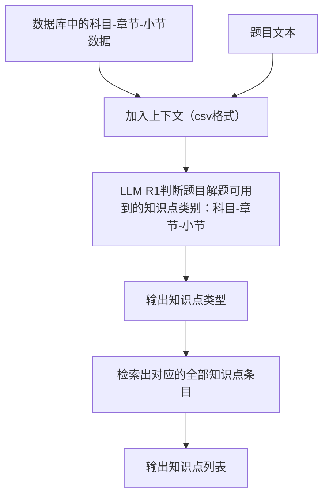
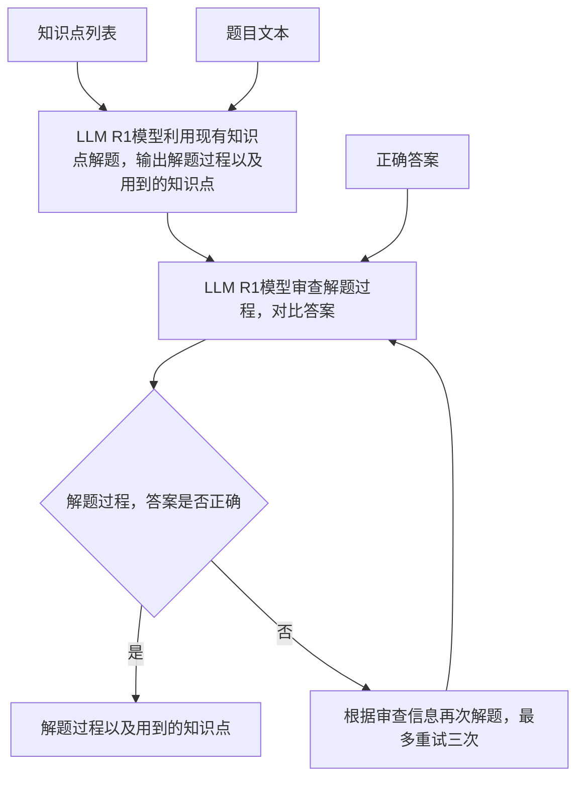
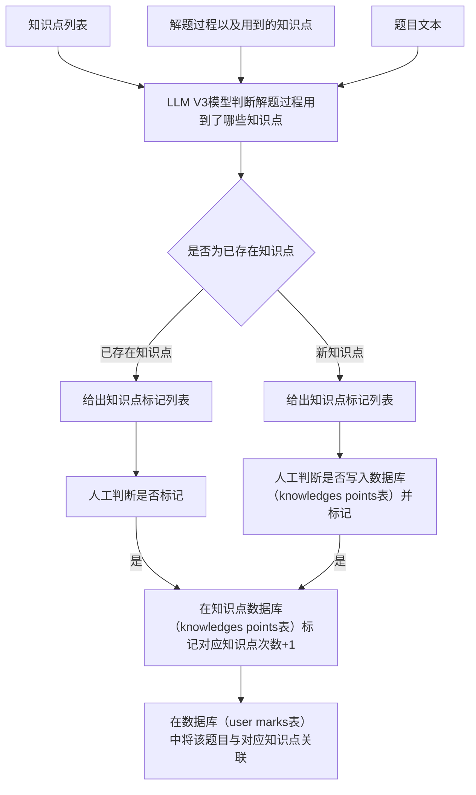

# GradNote - 错题知识点管理系统后端开发路线图

## 实施进度摘要 

- ✅ 阶段1: Langfuse集成与基础设施 - 已完成
- ✅ 阶段2: 知识点检索模块 - 已完成
- ✅ 阶段3: 解题模块 - 已完成
- ✅ 阶段4: 知识点标记模块 - 已完成
- ⏳ 阶段5: API版本化与测试 - 部分完成

## 重构计划 (Version 2.0)

### 背景与目标

基于现有的GradNote-v1后端代码，我们需要重构系统以实现更高效的流程，具体包括：

1. 优化知识点检索流程
2. 增强LLM解题工作流
3. 改进知识点标记机制
4. 集成Langfuse监控所有LLM调用

### 系统架构流程图

#### 知识点检索模块 (v2)


#### 解题模块 (v2)


#### 知识点标记模块 (v2)


### 1. API结构调整 (`/backend/app/api/`)

#### 1.1 版本化接口
- 保留现有接口以确保向后兼容

#### 1.2 知识点模块 (`/api/v1/knowledge`)
- **新增 `POST /analyze-from-question`** ✅
  - 实现题目文本分析，返回可能的知识点类别
  - Schema: `KnowledgeAnalyzeRequest`, `KnowledgeAnalyzeResponse`


- **优化 `GET /search`** ✅
  - 基于现有知识点检索功能优化查询性能
  - 支持按科目、章节、小节多维度检索

- **新增 `POST /extract-from-solution`** ✅
  - 实现从解题过程中提取使用的知识点
  - 区分"已有知识点"和"新知识点"
  - Schema: `KnowledgeExtractRequest`, `KnowledgeExtractResponse`

- **新增 `POST /mark-confirmed`** ✅
  - 实现用户确认知识点标记的功能
  - 处理已有知识点标记和新知识点创建
  - Schema: `KnowledgeMarkRequest`, `KnowledgeMarkResponse`

#### 1.3 解题模块 (`/api/v1/solving`)
- **实现 `POST /solve`** ✅
  - 使用LangGraph优化解题流程
  - 添加审查和重试机制
  - Schema: `SolveRequest`, `SolveResponse`


### 2. 数据模型 (`/backend/app/models/`)

已经有完善的数据模型，基本保持现状：

- **`KnowledgePoint`**: 已包含 `mark_count` 字段
- **`QuestionKnowledgeRelation`**: 已存在关联表
- **`UserMark`**: 已存在用户标记表
- **`WrongQuestion`**: 错题表已完善

### 3. LLM服务层 (`/backend/app/llm_services/`)


#### 3.2 知识点检索服务 ✅
- **创建 `knowledge_retriever/`** ✅
  - `__init__.py`
  - `retriever.py`: 实现 `LLMKnowledgeRetriever` 类
    - `analyze_knowledge_category()`: 分析题目所属知识点类别

#### 3.3 解题工作流 ✅
- **创建 `solving/workflow.py`** ✅
  - 使用LangGraph实现完整解题流程
  - 实现 `LLMSolvingWorkflow` 类
  - 包含解题、审查和重试节点

#### 3.4 知识点提取
- **增强 `knowledge_mark/extractor.py`** ✅
  - 增强 `KnowledgeExtractor` 类 ✅
  - 实现解题过程知识点提取 ✅
  - 区分已有知识点和新知识点 ✅

### 4. 服务层 (`/backend/app/services/`)

#### 4.1 知识点服务 ✅
- **优化 `knowledge.py`** ✅
  - 添加 `get_all_categories_csv()`: 获取知识点类别CSV ✅
  - 优化 `search_knowledge_points()`: 多条件查询 ✅

#### 4.2 知识点标记服务 ✅
- **创建 `knowledge_marking.py`** ✅
  - 实现 `apply_confirmed_markings()`: 处理用户确认的知识点标记 ✅
  - 处理新知识点创建和关联 ✅

#### 4.3 解题服务 ✅
- **实现 `solving.py`** ✅
  - 集成与LLM工作流的协调逻辑
  - 错题ID校验和错误处理

### 5. 实施计划

分阶段实施重构，确保系统稳定性：


#### 阶段2: 知识点检索模块 ✅ 
- 实现知识点类别分析
  - ✅ 创建LLMKnowledgeRetriever类
  - ✅ 实现analyze_knowledge_category方法
  - ✅ 创建知识点类别CSV转换功能
- 优化知识点检索
  - ✅ 添加/analyze-from-question API端点
  - ✅ 创建相关Schema


#### 阶段3: 解题模块 ✅
- 重构解题工作流
  - ✅ 创建LLMSolvingWorkflow类
  - ✅ 实现解题节点(_solve_node)
  - ✅ 实现审查节点(_review_node)
  - ✅ 实现条件路由(_should_retry)
- 添加审查和重试机制
  - ✅ 实现多次尝试解题逻辑
  - ✅ 错误处理和恢复机制


#### 阶段4: 知识点标记模块 ✅
- 实现知识点提取增强
  - ✅ 增强KnowledgeExtractor类
  - ✅ 添加extract_knowledge_points_from_solution方法
  - ✅ 区分已有知识点和新知识点
- 开发人工确认流程
  - ✅ 创建knowledge_marking服务
  - ✅ 实现apply_confirmed_markings函数
  - ✅ 添加/extract-from-solution API端点
  - ✅ 添加/mark-confirmed API端点
  - ✅ 创建相关Schema


#### 阶段5: API版本化与测试 ⏳
- 创建v1版本API ⏳
  - ✅ API_V1_STR配置 
  - ⏳ 路由v1前缀化
  - ⏳ 完整版本兼容测试
- 全面测试所有功能
  - ⏳ 端到端测试
  - ⏳ 单元测试


### 6. 示例代码

#### 解题工作流实现
```python
class LLMSolvingWorkflow:
    """
    基于LangGraph的解题工作流
    
    实现完整的解题流程，包括：
    1. 使用LLM解题
    2. 审查解题过程与结果
    3. 如果审查不通过，重试解题
    """
    
    def __init__(self, 
                 api_key: Optional[str] = None, 
                 api_base: Optional[str] = None, 
                 solving_model: Optional[str] = None,
                 review_model: Optional[str] = None):
        """
        初始化解题工作流
        """
        # 初始化解题LLM
        self.solving_llm = ChatOpenAI(
            api_key=api_key or OPENAI_API_KEY,
            base_url=api_base or OPENAI_API_BASE,
            model_name=solving_model or LLM_SOLVING_MODEL
        )
        
        # 初始化审查LLM
        self.review_llm = ChatOpenAI(
            api_key=api_key or OPENAI_API_KEY,
            base_url=api_base or OPENAI_API_BASE,
            model_name=review_model or LLM_REVIEW_MODEL
        )
        
        # 构建工作流图
        self.graph = self._build_graph()
        
    # 解题节点实现
    def _solve_node(self, state: SolveState) -> SolveState:
        """解题节点，使用LLM和知识点解答题目"""
        # 实现逻辑...
    
    # 审查节点实现
    def _review_node(self, state: SolveState) -> SolveState:
        """审查节点，检查解题过程是否正确"""
        # 实现逻辑...
    
    # 条件路由实现
    def _should_retry(self, state: SolveState) -> Literal["retry", "end"]:
        """决定是重试解题还是结束工作流"""
        # 实现逻辑...
    
    def _build_graph(self) -> StateGraph:
        """构建工作流图"""
        # 实现逻辑...
    
    def invoke(self, initial_state: Dict[str, Any]) -> SolveState:
        """运行解题工作流"""
        # 实现逻辑...
```

### 7. 技术栈 

- **Web框架**: FastAPI
- **ORM**: SQLAlchemy
- **LLM工具链**: LangChain, LangGraph
- **监控**: Langfuse
- **主要模型**: DeepSeek R1、DeepSeek V3

### 8. 预期收益

- 提高用户体验: 更准确的知识点检索和更高质量的解题
- 降低系统耦合性: 更模块化的设计
- 提高可维护性: 更清晰的职责分离
- 监控能力: 通过Langfuse实现LLM调用的完整可观测性

### 9. 最近更新

#### 解题模块完成

解题模块已完成开发工作，主要包括以下功能：

1. **基于LangGraph的解题工作流**:
   - 完整实现`LLMSolvingWorkflow`类，支持解题、审查和重试流程
   - 实现解题节点`_solve_node`，使用LLM和知识点解答题目
   - 实现审查节点`_review_node`，检查解题结果并提供改进建议
   - 实现条件路由`_should_retry`，支持最多3次解题尝试

2. **解题服务增强**:
   - 重构`solve_question`方法，支持解题工作流完整集成
   - 优化知识点处理和错误处理

3. **API端点完善**:
   - 完善了`POST /solving/{question_id}`接口实现
   - 支持错误处理和状态码映射

4. **模型支持**:
   - 添加了配置化的模型选择机制，支持DeepSeek系列模型
   - 通过环境变量配置解题模型和审查模型

#### 下一步开发计划

- 完成API版本化实现，确保向后兼容性
- 进行全面功能测试
- 开发更完善的错误处理和监控机制

