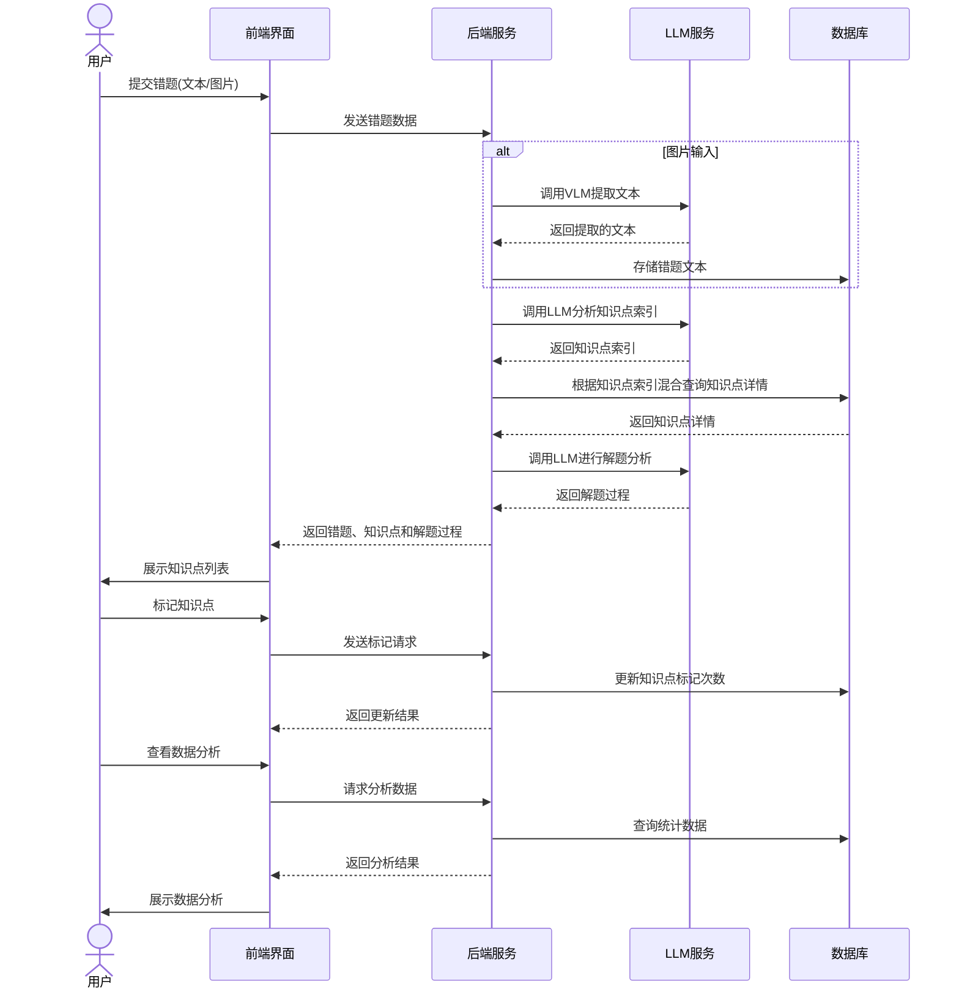
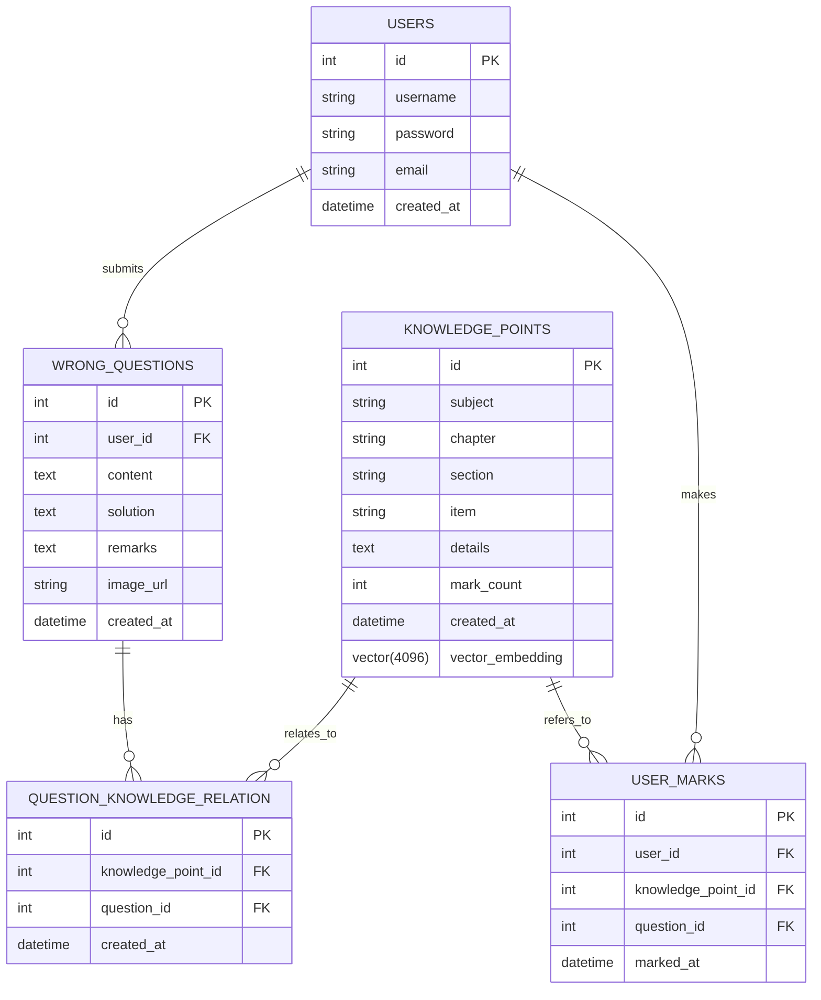
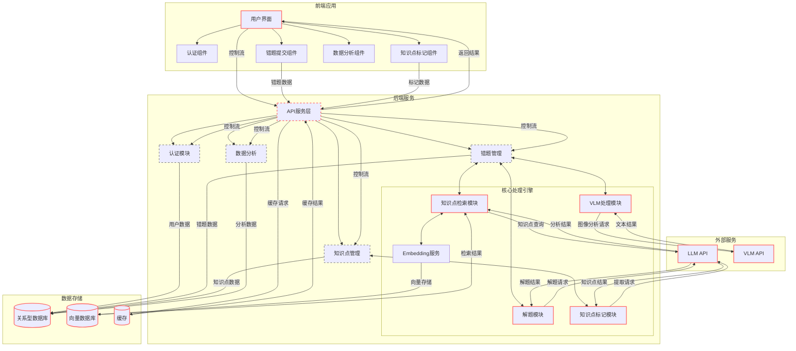
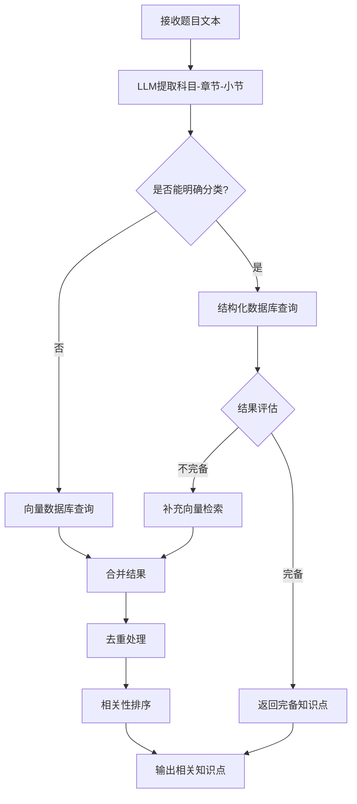
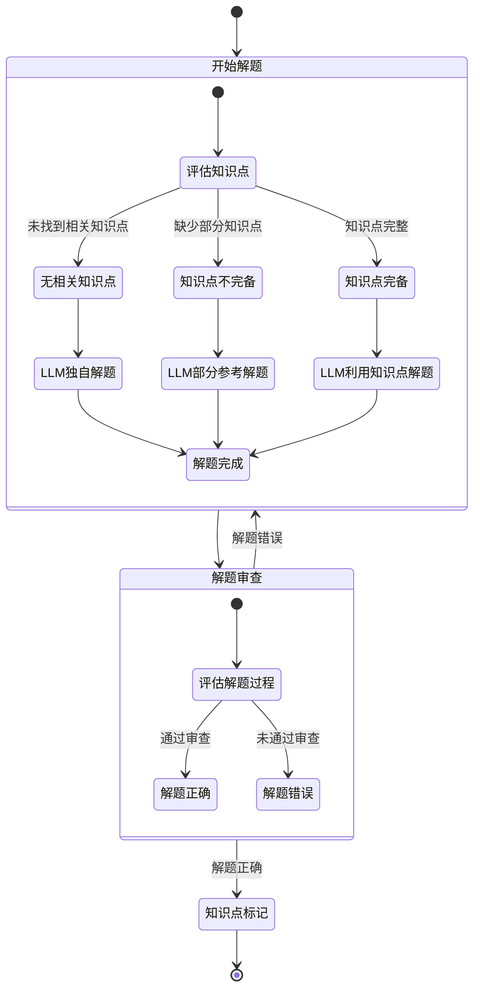
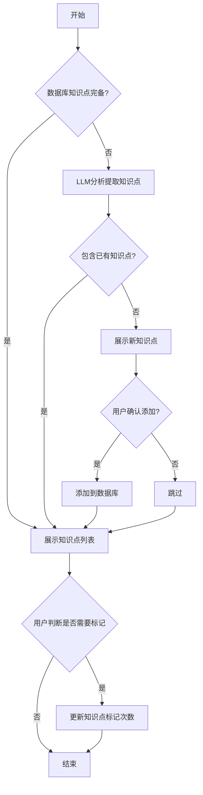

# 错题知识点管理系统设计文档

## 1. 系统概述

### 1.1 项目背景

本系统旨在帮助学习者管理错题并自动提取相关知识点。用户提交错题后，系统通过LLM和VLM技术自动分析错题内容，提取相关知识点，并允许用户标记这些知识点。系统还会提供数据分析功能，帮助用户了解自己的学习情况。

预期的使用方式是用户在完成一天的学习后，将当天的错题列表提交到系统，系统会根据用户提交的错题列表，自动提取出相关的知识点，在前端界面展示给用户，用户可以在展示的知识点列表中，选择是否标记该知识点，如果用户选择标记，系统会在数据库中标记该知识点的次数，以便后续的数据分析（给出日报、周报分析）。

### 1.2 核心功能

- 错题提交与管理
- 自动知识点提取与匹配
- 知识点标记与统计
- 解题过程分析
- 学习情况数据分析（日报、周报）

### 1.3 用户流程



## 2. 技术栈选择

### 2.1 前端技术

- **框架**: React
- **UI组件库**: Ant Design
- **数据可视化**: ECharts
- **HTTP客户端**: Axios

### 2.2 后端技术

- **后端框架**: fastapi
- **LLM集成**: VolcEngineMaas（火山引擎）deepseek-r1-250120
- **VLM集成**: VolcEngineMaas（火山引擎）doubao-1-5-vision-pro-32k-250115
- **Embedding模型**: VolcEngineMaas（火山引擎）doubao-embedding-large-text-240915
- **框架**:
  - LangChain: 用于管理LLM/VLM调用和知识检索
  - LangGraph: 用于构建复杂工作流
  - langfuse: 用于可观察性和性能分析

### 2.3 数据存储

- **关系型数据库**: PostgreSQL
- **向量数据库**: PostgreSQL+pgvector
- **缓存**: Redis

## 3. 数据库设计

### 3.1 ER图



### 3.2 表结构

#### 用户表 (users)
```sql
CREATE TABLE users (
    id SERIAL PRIMARY KEY,
    username VARCHAR(50) NOT NULL,
    password VARCHAR(100) NOT NULL,
    email VARCHAR(100) UNIQUE,
    created_at TIMESTAMP DEFAULT CURRENT_TIMESTAMP
);
```

#### 错题表 (wrong_questions)
```sql
CREATE TABLE wrong_questions (
    id SERIAL PRIMARY KEY,
    user_id INTEGER REFERENCES users(id),
    content TEXT NOT NULL,
    solution TEXT,
    remarks TEXT,
    image_url VARCHAR(255),
    created_at TIMESTAMP DEFAULT CURRENT_TIMESTAMP
);
```

#### 知识点表 (knowledge_points)
```sql
CREATE TABLE knowledge_points (
    id SERIAL PRIMARY KEY,
    subject VARCHAR(50) NOT NULL,
    chapter VARCHAR(100) NOT NULL,
    section VARCHAR(100) NOT NULL,
    item VARCHAR(100) NOT NULL,
    details TEXT,
    mark_count INTEGER DEFAULT 0,
    vector_embedding vector(4096),  -- 存储向量表示，维度根据embedding模型决定
    created_at TIMESTAMP DEFAULT CURRENT_TIMESTAMP
);
```

#### 题目-知识点关联表 (question_knowledge_relation)
```sql
CREATE TABLE question_knowledge_relation (
    id SERIAL PRIMARY KEY,
    knowledge_point_id INTEGER REFERENCES knowledge_points(id),
    question_id INTEGER REFERENCES wrong_questions(id),
    created_at TIMESTAMP DEFAULT CURRENT_TIMESTAMP
);
```

#### 用户标记记录表 (user_marks)
```sql
CREATE TABLE user_marks (
    id SERIAL PRIMARY KEY,
    user_id INTEGER REFERENCES users(id),
    knowledge_point_id INTEGER REFERENCES knowledge_points(id),
    question_id INTEGER REFERENCES wrong_questions(id),
    marked_at TIMESTAMP DEFAULT CURRENT_TIMESTAMP
);
```

### 3.3 索引设计

```sql
-- 科目-章节-小节复合索引，提高结构化查询性能
CREATE INDEX idx_knowledge_subject_chapter_section ON knowledge_points(subject, chapter, section);

-- 标记次数索引，提高热门知识点查询性能
CREATE INDEX idx_knowledge_mark_count ON knowledge_points(mark_count DESC);

-- 向量索引，提高相似度搜索性能
CREATE INDEX idx_knowledge_vector ON knowledge_points USING ivfflat (vector_embedding vector_cosine_ops) WITH (lists = 100);

-- 错题表用户ID索引
CREATE INDEX idx_wrong_questions_user_id ON wrong_questions(user_id);

-- 用户标记记录复合索引
CREATE INDEX idx_user_marks_user_knowledge ON user_marks(user_id, knowledge_point_id);
```

## 4. 系统架构设计

### 4.1 整体架构



### 4.2 知识点检索模块详细设计



### 4.3 解题模块详细设计



### 4.4 知识点标记模块详细设计



## 5. 核心模块实现

### 5.1 知识点检索模块

#### 5.1.1 混合检索策略实现

```python
from langchain_openai import ChatOpenAI
from langchain.schema import Document
from langchain.vectorstores import FAISS
from langchain.embeddings import OpenAIEmbeddings

# 初始化LLM和向量存储
llm = ChatOpenAI(model="deepseek-r1-250120")
embeddings = OpenAIEmbeddings(model="doubao-embedding-large-text-240915")

@traceable
def extract_subject_info(question_text):
    """提取题目所属的科目、章节、小节"""
    prompt = f"""分析以下题目，确定其所属的科目、章节和小节。
    题目：{question_text}
    
    请以JSON格式返回结果：
    {{
        "subject": "科目名称",
        "chapter": "章节名称",
        "section": "小节名称",
        "confidence": 分数 # 0-10的置信度
    }}
    """
    
    response = llm.predict(prompt)
    # 解析JSON响应
    import json
    try:
        result = json.loads(response)
        return result
    except:
        # 解析失败则返回低置信度结果
        return {
            "subject": "未知",
            "chapter": "未知",
            "section": "未知",
            "confidence": 0
        }

@traceable
def get_structured_knowledge_points(subject, chapter, section):
    """从结构化数据库获取知识点"""
    # 数据库查询
    query = """
    SELECT id, subject, chapter, section, item, details 
    FROM knowledge_points 
    WHERE subject = %s AND chapter = %s AND section = %s
    """
    results = db.execute(query, (subject, chapter, section)).fetchall()
    
    # 转换为Document对象
    return [
        Document(
            page_content=r["details"] or r["item"],
            metadata={
                "id": r["id"],
                "subject": r["subject"],
                "chapter": r["chapter"],
                "section": r["section"],
                "item": r["item"]
            }
        ) for r in results
    ]

@traceable(run_type="retriever")
def get_vector_knowledge_points(question, k=8, similarity_threshold=0.75):
    """使用向量检索获取知识点（使用PGVector）"""
    # 使用PGVector进行相似度查询
    raw_results = pg_vector.similarity_search_with_score(question, k=k)
    
    # 过滤掉相似度低于阈值的结果
    filtered_results = [
        doc for doc, score in raw_results 
        if score >= similarity_threshold
    ]
    
    # 如果过滤后结果太少，可以适当放宽条件
    if len(filtered_results) < 3 and raw_results:
        # 至少返回前3个结果（如果有）
        return [doc for doc, _ in raw_results[:3]]
    
    return filtered_results

@traceable
def evaluate_results(knowledge_points, question):
    """评估知识点是否完备（改进版：使用结构化响应）"""
    if not knowledge_points:
        return False
        
    knowledge_text = "\n".join([
        f"- {doc.metadata['subject']}/{doc.metadata['chapter']}/{doc.metadata['section']}: {doc.metadata['item']}"
        for doc in knowledge_points
    ])
    
    prompt = f"""判断以下知识点是否足够解答这个问题：
    
    问题：{question}
    
    知识点：
    {knowledge_text}
    
    请以JSON格式返回结果：
    {{
        "is_complete": true/false,  # 知识点是否完备
        "missing_concepts": ["概念1", "概念2"],  # 缺少的关键概念（如有）
        "confidence": 0-10,  # 置信度分数
        "reasoning": "推理过程"  # 简要说明理由
    }}
    """
    
    response = llm.predict(prompt)
    
    # 解析JSON响应
    import json
    try:
        result = json.loads(response)
        return result["is_complete"] and result["confidence"] >= 7
    except:
        # 解析失败则保守返回False
        return False

@traceable
def get_knowledge_points_hybrid(question):
    """混合检索策略实现"""
    # 1. 提取题目信息
    subject_info = extract_subject_info(question)
    
    # 2. 判断置信度
    if subject_info["confidence"] >= 7:  # 高置信度，使用结构化查询
        structured_results = get_structured_knowledge_points(
            subject_info["subject"], 
            subject_info["chapter"], 
            subject_info["section"]
        )
        
        # 评估结构化结果
        if evaluate_results(structured_results, question):
            return {
                "knowledge_points": structured_results,
                "is_complete": True,
                "retrieval_method": "structured"
            }
        
        # 结构化结果不完备，补充向量检索
        vector_results = get_vector_knowledge_points(question)
        all_results = merge_and_deduplicate(structured_results, vector_results)
        
        return {
            "knowledge_points": all_results,
            "is_complete": evaluate_results(all_results, question),
            "retrieval_method": "hybrid"
        }
    else:
        # 低置信度，直接使用向量检索
        vector_results = get_vector_knowledge_points(question)
        
        return {
            "knowledge_points": vector_results,
            "is_complete": evaluate_results(vector_results, question),
            "retrieval_method": "vector"
        }

def merge_and_deduplicate(list1, list2):
    """合并并去重两个知识点列表"""
    result = list1.copy()
    existing_ids = {doc.metadata["id"] for doc in result}
    
    for doc in list2:
        if doc.metadata["id"] not in existing_ids:
            result.append(doc)
            existing_ids.add(doc.metadata["id"])
    
    return result
```

### 5.2 解题模块

#### 5.2.1 使用LangGraph实现解题工作流

```python
from langgraph.graph import StateGraph
from typing import Dict, TypedDict, List, Optional, Literal
from langchain.schema import Document

# 定义状态类型
class SolveState(TypedDict):
    question: str
    knowledge_points: List[Document]
    is_complete: bool
    solution: Optional[str]
    review_passed: Optional[bool]
    attempts: int
    existing_knowledge_points: Optional[List[Document]]
    new_knowledge_points: Optional[List[Document]]
    knowledge_complete_after_extraction: Optional[bool]

# 节点函数
@traceable
def solve_question(state: SolveState) -> SolveState:
    """解题节点"""
    question = state["question"]
    knowledge_points = state["knowledge_points"]
    is_complete = state["is_complete"]
    attempts = state["attempts"]
    
    # 根据知识点完备性选择解题策略
    if not knowledge_points:
        prompt = f"""请解答以下问题：
        
        问题：{question}
        
        注意：这个问题没有相关的知识点参考，请基于你的知识解答。
        
        """
    elif not is_complete:
        knowledge_text = "\n".join([
            f"- {doc.metadata['subject']}/{doc.metadata['chapter']}/{doc.metadata['section']}: {doc.metadata['item']}\n  {doc.page_content}"
            for doc in knowledge_points
        ])
        
        prompt = f"""请依据以下知识点解答问题：
        
        问题：{question}
        
        参考知识点（不完备）：
        {knowledge_text}
        
        注意：提供的知识点可能不完整，请补充必要的知识解答问题。
        
        """
    else:
        knowledge_text = "\n".join([
            f"- {doc.metadata['subject']}/{doc.metadata['chapter']}/{doc.metadata['section']}: {doc.metadata['item']}\n  {doc.page_content}"
            for doc in knowledge_points
        ])
        
        prompt = f"""请严格依据以下完整知识点解答问题：
        
        问题：{question}
        
        参考知识点（完备）：
        {knowledge_text}
        
        注意：请确保你的解答完全基于提供的知识点。
        
        """
    
    # 调用 LLM
    solution = llm.predict(prompt)
    
    # 更新状态
    return {
        **state,
        "solution": solution,
        "attempts": attempts + 1
    }

@traceable
def review_solution(state: SolveState) -> SolveState:
    """审查解题过程"""
    question = state["question"]
    solution = state["solution"]
    knowledge_points = state["knowledge_points"]
    
    knowledge_text = "\n".join([
        f"- {doc.metadata['subject']}/{doc.metadata['chapter']}/{doc.metadata['section']}: {doc.metadata['item']}"
        for doc in knowledge_points
    ])
    
    prompt = f"""请审查以下解题过程是否正确：
    
    问题：{question}
    
    相关知识点：
    {knowledge_text}
    
    解题过程：
    {solution}
    
    请评估：
    1. 解题过程是否正确
    2. 是否使用了正确的方法
    3. 是否有计算错误
    4. 是否有概念性错误
    
    回复时遵守以下格式：
    {{
        "passed": true/false,  # 是否通过审查
        "reason": "审查理由"  # 简要说明理由
    }}
    """
    
    try:
        review_response = json.loads(llm.predict(prompt))
        review_passed = review_response.get("passed", False)  # 默认 False
        review_reason = review_response.get("reason", "未提供理由")
    except (json.JSONDecodeError, KeyError) as e:
        review_passed = False
        review_reason = f"解析错误: {str(e)}"

    # 更新状态
    return {
        **state,
        "review_passed": review_passed,
        "review_reason": review_reason
    }

@traceable
def mark_knowledge_points(state: SolveState) -> SolveState:
    """知识点标记节点"""
    # 只有当解题通过审查且不完备时才进行知识点提取
    if state["review_passed"] and not state["is_complete"]:
        knowledge_result = process_knowledge_points(state)
        
        return {
            **state,
            "existing_knowledge_points": knowledge_result["existing_points"],
            "new_knowledge_points": knowledge_result["new_points"],
            "knowledge_complete_after_extraction": knowledge_result["is_complete"]
        }
    
    # 如果知识点已完备或解题未通过审查，不进行知识点提取
    return {
        **state,
        "existing_knowledge_points": state["knowledge_points"],
        "new_knowledge_points": [],
        "knowledge_complete_after_extraction": state["is_complete"]
    }

# 条件路由
def should_retry(state: SolveState) -> Literal["end", "retry"]:
    if state["review_passed"] or state["attempts"] >= 3:  # 通过审查或达到最大尝试次数
        return "end"
    else:
        return "retry"

# 构建图
solve_graph = StateGraph(SolveState)
solve_graph.add_node("solve", solve_question)
solve_graph.add_node("review", review_solution)
solve_graph.add_node("mark", mark_knowledge_points)  # 添加知识点标记节点

# 定义边
solve_graph.add_edge("solve", "review")
solve_graph.add_conditional_edges("review", should_retry, {
    "end": "mark",  # 解题通过或达到最大尝试次数后进入标记阶段
    "retry": "solve"  # 解题未通过则重试
})
solve_graph.add_edge("mark", END)  # 使用 LangGraph 的 END 表示结束

# 设置起始节点
solve_graph.set_entry_point("solve")

# 编译
solve_workflow = solve_graph.compile()

# 使用工作流
def process_question(question, knowledge_points, is_complete):
    initial_state = {
        "question": question,
        "knowledge_points": knowledge_points,
        "is_complete": is_complete,
        "solution": None,
        "review_passed": None,
        "attempts": 0,
        "existing_knowledge_points": None,
        "new_knowledge_points": None,
        "knowledge_complete_after_extraction": None
    }
    
    result = solve_workflow.invoke(initial_state)
    return result
```

### 5.3 知识点标记模块
#### 5.3.1 知识点提取
```python
@traceable
def process_knowledge_points(solve_state: SolveState):
    """
    处理知识点标记，接收解题状态作为输入
    
    Args:
        solve_state: 解题状态，包含问题、解题过程和已有知识点
        
    Returns:
        包含现有知识点和新知识点的字典
    """
    # 从状态中提取信息
    question_text = solve_state["question"]
    solution = solve_state["solution"]
    existing_knowledge_points = solve_state["knowledge_points"]
    
    # 如果没有知识点或已标记为完备，直接返回
    if solve_state.get("is_complete", False):
        return {
            "existing_points": existing_knowledge_points,
            "new_points": [],
            "is_complete": True
        }
    
    # 根据是否有已存在的知识点，选择不同的提示模板
    if existing_knowledge_points and len(existing_knowledge_points) > 0:
        # 有一些知识点，但不完备，需要补充其他知识点
        # 将已有知识点加入上下文，避免提取重复知识点
        existing_points_text = "\n".join([
            f"- {point.metadata['subject']}/{point.metadata['chapter']}/{point.metadata['section']}: "
            f"{point.metadata['item']} - {point.page_content}"
            for point in existing_knowledge_points
        ])
        
        prompt = f"""请从以下解题过程中提取关键知识点，注意避免与已有知识点重复：
        
        题目：{question_text}
        
        解题过程：
        {solution}
        
        已有知识点：
        {existing_points_text}
        
        请以JSON格式列出额外需要的知识点（避免与已有知识点重复），包括：
        - subject: 科目
        - chapter: 章节
        - section: 小节
        - item: 具体知识点名称
        - details: 知识点详细说明
        
        如果没有需要补充的知识点，请返回空数组 []
        
        例如：
        [
            {{
                "subject": "高等数学",
                "chapter": "一元函数微分学的应用",
                "section": "单调性与极值的判断",
                "item": "单调性的判别",
                "details": "如果在区间I上，导数f'(x)>0，则f(x)在I上单调递增；如果f'(x)<0，则f(x)在I上单调递减。"
            }}
        ]
        """
    else:
        # 没有任何知识点，需要完全提取
        prompt = f"""请从以下解题过程中提取所有关键知识点：
        
        题目：{question_text}
        
        解题过程：
        {solution}
        
        请以JSON格式列出所有必要的知识点，包括：
        - subject: 科目
        - chapter: 章节
        - section: 小节
        - item: 具体知识点名称
        - details: 知识点详细说明
        
        例如：
        [
            {{
                "subject": "高等数学",
                "chapter": "一元函数微分学的应用",
                "section": "单调性与极值的判断",
                "item": "单调性的判别",
                "details": "如果在区间I上，导数f'(x)>0，则f(x)在I上单调递增；如果f'(x)<0，则f(x)在I上单调递减。"
            }}
        ]
        """
    
    # 调用LLM提取知识点
    response = llm.predict(prompt)
    
    # 解析JSON响应
    import json
    try:
        extracted_points = json.loads(response)
    except json.JSONDecodeError:
        extracted_points = []
    
    # 返回提取出的知识点
    return extracted_points
```
#### 5.3.2 用户判断是否标记知识点
将process_knowledge_points函数返回的知识点列表，通过前端展示给用户，用户判断是否标记知识点。
如果用户判断需要标记，则将知识点添加到数据库中，并将mark_count+1，否则不添加。

## 6. 前端界面设计

### 6.1 错题提交界面

- 支持文本输入和图片上传
- 实时预览和编辑
- 错误原因记录
- 提交按钮

### 6.2 知识点标记界面

- 错题内容展示
- 解题过程展示
- 相关知识点列表（可标记）
- 新知识点添加区域
- 标记历史记录

### 6.3 数据分析界面

- 知识点热力图
- 标记频率统计
- 学习进度趋势图
- 科目分布饼图
- 日报/周报生成

## 7. 接口设计

### 7.1 认证API

```
POST /api/auth/login - 用户登录获取访问令牌
POST /api/auth/register - 用户注册
```

### 7.2 错题管理API

```
POST /api/questions - 创建新错题
GET /api/questions - 获取错题列表
GET /api/questions/{question_id} - 获取错题详情
PUT /api/questions/{question_id} - 更新错题
DELETE /api/questions/{question_id} - 删除错题
POST /api/questions/from-image - 从图片创建错题（一步完成图片处理与错题创建）
```

### 7.3 图像处理API

```
POST /api/image/process - 处理错题图像并提取文本（不创建错题，仅处理图像）
```

### 7.4 知识点管理API

```
GET /api/knowledge/structure - 基于结构化信息（科目、章节、小节）查询知识点
GET /api/knowledge/search - 按条件搜索知识点
GET /api/knowledge/popular - 获取最热门的知识点（根据标记次数）
GET /api/knowledge/subjects - 获取所有科目列表
GET /api/knowledge/chapters - 获取指定科目的所有章节
GET /api/knowledge/sections - 获取指定科目和章节的所有小节
GET /api/knowledge/{knowledge_point_id} - 根据ID获取知识点详情
POST /api/knowledge/mark/{knowledge_point_id} - 增加知识点标记次数
POST /api/knowledge/user-mark - 创建用户知识点标记记录
GET /api/knowledge/user-marks - 获取当前用户的所有标记
```

### 7.5 解题API

```
POST /api/solving/{question_id} - 解答错题
POST /api/solving/extract/{question_id} - 从错题中提取知识点
```


## 9. 开发计划

### 第一阶段：核心后端功能实现
- **搭建后端API服务框架**
  - 实现用户基本认证模块
  - 设计并创建数据库（传统关系型数据库部分）

  - 添加基本错误处理机制
- **核心功能实现**
  - 错题提交与存储功能
  - 知识点检索模块（传统检索实现，基于科目-章节-知识点的结构化查询）
  - 解题模块
  - 知识点标记模块

### 第二阶段：基础前端界面与系统稳定性
- **基础前端界面开发**
  - 最小可行的错题提交界面
  - 知识点标记界面
  - 基本的结果展示界面
- **系统稳定性增强**
  - 完善错误处理
  - 数据库查询优化
  - 缓存策略实现
  - 单元测试框架搭建

### 第三阶段：功能完善与性能优化
- **数据分析功能实现**
  - 知识点统计
  - 基础报表生成
- **系统性能优化**
  - 数据库索引优化
  - API响应速度提升
  - 批量处理策略
- **混合检索实现**
  - 向量检索模块
  - 向量检索与传统检索的结合（传统检索结果不佳时，fallback到向量检索）

### 第四阶段：运维与扩展功能
- **运维能力建设**
  - 日志收集与分析
  - 系统监控实现
  - 基本的CI/CD流程
  - 用户角色与权限管理
- **扩展功能开发**
  - 更完善的数据分析界面
  - 数据备份恢复机制
  - 系统部署文档

### 第五阶段：用户体验与系统完善
- **用户体验优化**
  - 前端界面美化
  - 响应式设计（基础移动端适配）
  - 用户操作流程优化
- **系统全面测试与完善**
  - 集成测试
  - 用户验收测试
  - 文档完善
  - 系统发布准备

## 10. 系统扩展性考虑

1. **多学科支持**: 系统设计允许扩展到更多学科
2. **学习计划生成**: 基于标记的知识点生成个性化学习计划
3. **与第三方教育平台集成**: 提供API接口与其他教育系统集成

## 11. 结语

本设计文档详细描述了错题知识点管理系统的各个方面，包括系统架构、数据库设计、核心模块实现、前端界面设计和开发计划。系统采用混合检索策略、LangChain、LangGraph和Langfuse等先进技术，以实现高效、智能的错题管理和知识点提取功能。
